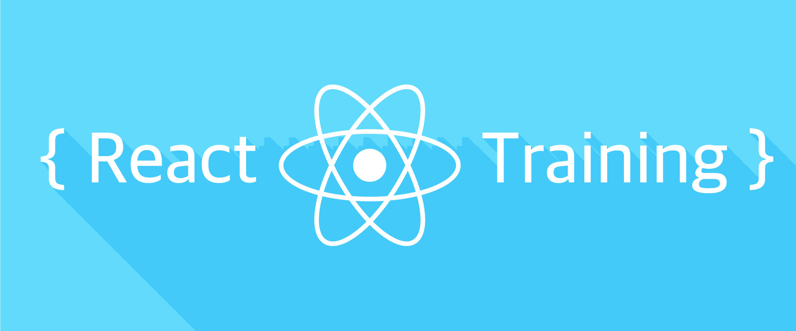

# ReactJS Training

El objetivo de esta capacitación es introducir al desarrollo web mediante el ecosistema ReactJS a cualquier desarrollador/a. Consiste en diferentes ejercicios que se centran en temas específicos que se aprenderán mientras se programa. Puede encontrar las diapositivas que presentan los ejercicios de esta capacitación [aquí](https://docs.google.com/presentation/d/1iB-UDYZbJEOfXmJJ3kj-EklgE_rDcAo-eVZO7fFVcN8/edit#slide=id.g3ec7f0c99c_0_9).

### Key takeaways:

Los participantes aprenderán:

- Los fundamentos del desarrollo web hoy (2020)
- Cómo usar React y TypeScript para crear aplicaciones web
- Cómo almacenar y administrar el estado de su aplicación web con React y Redux
- Cómo construir aplicaciones optimizadas, listas para producción con cero configuración.

### Prerequisitos

Quien participe deberá instalar:

- [Node 8.x](https://nodejs.org/en/) o mayor en su laptop.
- [Visual Studio Code](https://code.visualstudio.com/).
- [Redux devtools instaladas en tu browser](https://github.com/zalmoxisus/redux-devtools-extension#installation).

## Ejercicios

El taller se divide en cuatro ejercicios:

- [Introducción a React y TypeScript](./exercise-1)
- [Creando nuestra primera aplicación web con React y TypeScript](./exercise-2)
- [Manejando el estado de nuestra aplicación con Redux](./exercise-3)
- [Cómo agregar navegación en nuestra aplicación](./exercise-4)
- [Tópicos avanzados](./exercise-5)

Cada ejercicio tiene todo lo que necesita para comenzar dentro de la carpeta **begin** y el resultado que esperamos que logre dentro de la carpeta **end**.

No necesita completar ningún ejercicio anterior para comenzar uno nuevo. Puede usar lo que creó antes o el contenido de la carpeta **begin** que encontrará en cada ejercicio.
