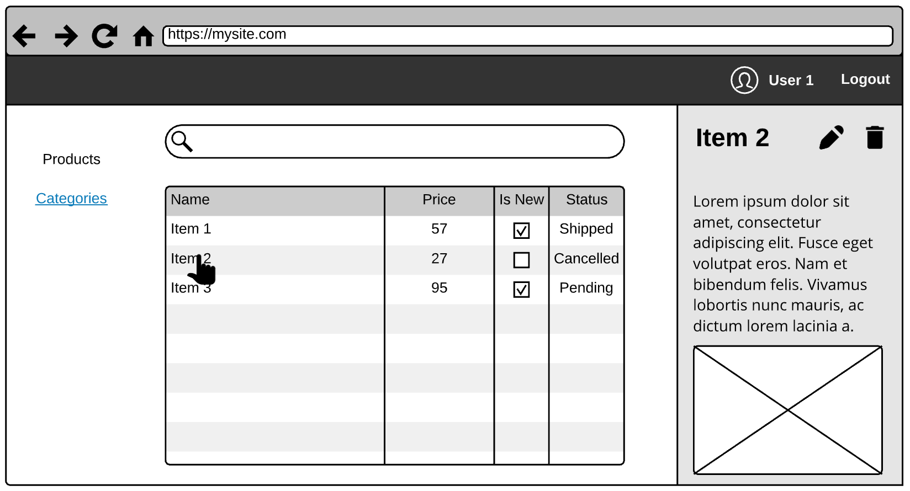
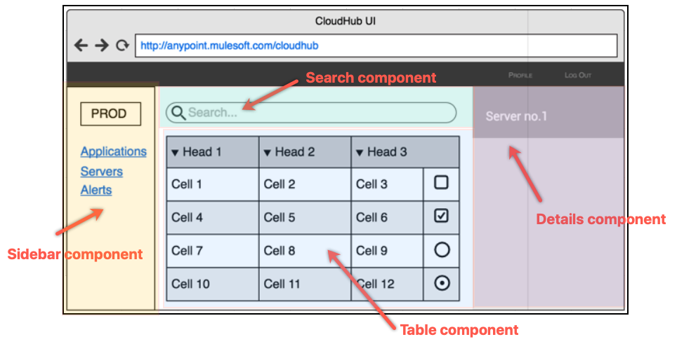
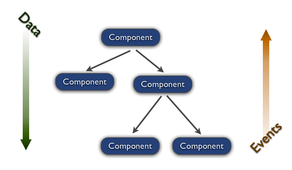
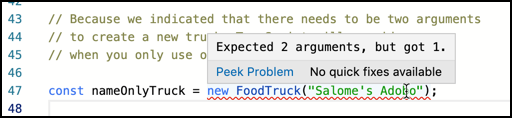
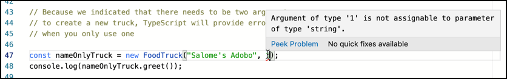

# Understanding React and TypeScript

In this exercise, we will introduce the two core libraries that we will use to develop web applications: [React](https://reactjs.org/) and [TypeScript](https://www.typescriptlang.org/). For this, we'll go through small but concrete examples that will help us to understand the main concepts, one at a time.

But before starting to code, we need to understand what we are going to do. Think about the most common user interface (UI) layout you've seen, and ask yourself:

1. If I have to make this, where should I start? Do I have to do all by myself? Is there something out there that I can use?
1. How can I split the work into different tasks? What are the most important ones?
1. Is it possible to reuse what I'm going to do with other or future projects?



In the next sections, we will work together to propose answers to these questions.

## Introduction: web-based development

Before starting, let's do a quick recap of the foundational concepts of web development. If you know about them, you can skip this part and jump directly to Section 1.

- Web applications are, basically, applications that can be executed by a (web) browser (Chrome, Firefox, Edge, Safari, Internet Explorer, etc.).
- Web browsers only understand HTML, JavaScript and CSS.
  - HTML provides the basic structure of sites, aka its markup.
  - CSS is used to control presentation, formatting, and layout, aka its styles.
  - JavaScript is used to change the behavior of different HTML elements and CSS styles dynamically. Usually depending on the user interaction (e.g., a click of a button, a tap of the finger or even speech).

For instance, when you navigate to the Google site because you want to search for something, you are using a web application!


In this case:

1. The structure of the page is defined using HTML (the text displayed as results, the right section, etc.).
1. How the structure looks is configured using CSS (the green color of the URLs, the design of the results that are videos, etc.).
1. You control the user interaction with JS code. For instance, what happens when someone types a question and press ENTER is configured with code.

The amount of things that we can do in any web application and the complexity of them has grown over time. Fortunately, we can now (re)use JavaScript libraries to avoid reinventing the wheel and reduce the repetitive work. **React** and **TypeScript** are some of these libraries.

## Section 1: What ReactJS is and what it is for

> **Note:** If you want to know more about ReactJS, go to the official [Getting Started](https://reactjs.org/docs/getting-started.html).

React is a JavaScript library for building user interfaces. One of the greatest things about React is that it changes the way you usually think about creating an app. It proposes you to split the logic into pieces, named **components**, following the [single responsibility principle or SRP](https://en.wikipedia.org/wiki/Single_responsibility_principle): every piece (component) should do only one thing.

Using our previous UI layout as an example, we can split the page in (for instance) the following components:

- A _TableComponent_, to display all of our entities.
- _SearchComponent_, to filter the entities we show.
- _DetailsComponent_, to display information related to a selected entity.
- _SidebarPanelComponent_, to encapsulate the logic of what we render in the left panel (the links and _PROD_ button).
- ...and so on



The way we split our layout into components is entirely arbitrary and, although it might look hard to do today, will become easier over time. The experience will, in time, tell us what is the best choice in terms of reusability and maintenance.

> **Note:** We can continue splitting the components we defined into smaller components, each one responsible of doing a single task. Can you propose how to break the _TableComponent_ component into smaller pieces?

### React in action

Like we said before, React is a library that will help us to build our UI by splitting it into components. Let's figure out together what the above means by checking the following examples (from the ReactJS documentation):

1. Open the **Hello React!** example by clicking [here](https://codesandbox.io/s/hello-react-lbisk).
1. Take a few minutes to analyze the code. Notice that the App componet is a React function only returning _JSX syntax_.

   > **What is JSX?** JSX is the de-facto syntax extension to render HTML elements in the React ecosystem. It's not HTML, but the syntax is pretty similar. It may remind you of a template language, but it also comes with the full power of JavaScript. If you want to learn more about JSX, see [here](https://reactjs.org/docs/introducing-jsx.html).

   **Browsers do not understand JSX**. To make our code work in browsers, we need to _transpile_ our code into JavaScript code that browsers can understand. We don't need to worry about this for now, but you do need to realize that the end result of this code is plain, old JavaScript:

   ```js
   var App = function() {
     return React.createElement("h1", null, "Hello React!");
   };
   var rootElement = document.getElementById("root");

   ReactDOM.render(React.createElement(App, null), rootElement);
   ```

1. We will now modify the example by providing the ability to customize the message rendered by the application. Replace the hardcoded message with a `message` property (of an object argument) that you will set when configuring the React component. In short:

   1. Provide a `message` property to the `App` component:

      ```js
      ReactDOM.render(<App message="Hello React!!" />, rootElement);
      ```

   1. Update the App component definition with the following code:

      ```js
      const App = ({ message }) => <h1>{message}</h1>;
      ```

   React functions can receive arbitrary, read-only input named **props** (short for _properties_). These **props**, model what the function returns. For instance, in our previous example, the message we output in the browser depends on the `message` property.

   > **Note:** As a general rule, all React functions & components must act as _pure functions_ with respect to their props. Meaning that what they return (or render) in the browser is determined by its input values, but without mutating the arguments received (also known as a _"side effect"_).

1. Let's move to another example. Open the **React Timer** example by clicking [here](https://codesandbox.io/s/react-timer-2y4k8).
1. The code looks more complicated now, take a few minutes to review it. Notice that we now have two files: an _index.jsx_ file that initializes our app and a _Timer.jsx_ file that defines a React component. This component is a class that extends from `React.Component`, has a `constructor()` and four other methods.

   ```js
   export default class Timer extends React.Component {
     constructor(props) { ... }

     tick() { ... }

     componentDidMount() { ... }

     componentWillUnmount() { ... }

     render() {
       return <div>Seconds: {this.state.seconds}</div>;
     }
   }
   ```

   React lets you define components as classes or functions. When you extend from **React.Component**, the only requirement is to define a **render()** method, responsible for returning the JSX elements that will be displayed in the browser. Additionally, a React class component provides other built-in methods that are executed at particular (but specific) times. You can **hook** your own code to these [lifecycle methods](https://reactjs.org/docs/react-component.html#the-component-lifecycle) by just implementing them. Some of these methods are the `constructor()`, `componentWillMount()`, `componentWillUnmount()`, but there are others.

   > **Note:** The **render()** method is an equivalent of the React function that we used in the previous example.

1. Now, notice that the custom `tick()` method in updates the component's state by calling `this.setState()`.

   ```js
   export default class Timer extends React.Component {

     ...

     tick() {
       this.setState(prevState => ({ seconds: prevState.seconds + 1 }));
     }

     ...
   }
   ```

   Every React Component could store its local state in `this.state`. **State** is similar to props, but it is private and fully controlled by the component. **The state MUST NOT be modified directly**. Instead, you should always the `this.setState()` method and return a new state.

   > **Note:** The reason why you should not mutate the state directly is that a state update could _potentially_ trigger a new execution of the `render()` method, redrawing the component. If you use `this.setState()` React will make this call for you, along with other calculations.

1. Last, check the code inside the `componentDidMount()` and `componentWillUnmount()`. This code is in charge of initializing, executing and cleaning up the timer. And by using these two built-in methods, React guarantees to execute your code when the component is rendered in the DOM ("mounted" ) and when it is removed from the DOM ("unmounted".

   ```js
   export default class Timer extends React.Component {

     ...

     componentDidMount() {
       this.interval = setInterval(() => this.tick(), 1000);
     }

     componentWillUnmount() {
       clearInterval(this.interval);
     }

     ...
   }
   ```

   > **Note:** If you want to know more about state and lifecycle, see [here](https://reactjs.org/docs/state-and-lifecycle.html)

1. We are now in the last example of the section. Open the **Questionnaire** example by clicking [here](https://codesandbox.io/s/react-questionnaire-4che1).
1. Take a few minutes to analyze all the pieces of code involved and the responsibility of each one of them. Then, play with the checkboxes and see the results.
1. Open the **Question.jsx** and **Answer.jsx** and notice that these files model a React function (or React functional component) that receive different props and returns a result, modeled via JSX.

   ```js
   export default ({ question, value }) => (
     <p>
       <span>{`${question}: ${value}`}</span>
     </p>
   );
   ```

1. Open the **Questionnaire.jsx** file. Take a look at the methods used by rendering the different pieces of the component: the questions and the answers. Notice how we orchestrate all the drawing logic using the `render()` method.

   > **Note:** React Fragment is a built-in component used to (logically) group a list of children without adding extra nodes to the DOM. If you want to learn more about it, click [here](https://reactjs.org/docs/fragments.html).

1. Now, focus on the `renderQuestions()` method and locate the `onChange` prop. We pass to this prop a `this.handleQuestionChanged()` method that will update the UI if the question is answered. And will store the value in the (Questionnaire) component's state.

   ```js
   export default class Questionnaire extends React.PureComponent {

     ...

     renderQuestions() {
       if (!questions.length) {
         return null;
       }

       return questions.map(question => (
         <Question
           key={question.id}
           id={question.id}
           text={question.text}
           checked={question.value}
           onChange={this.handleQuestionChanged}
         />
       ));
     }

     ...
   }
   ```

   Observe that the way we handle the user interaction (via _"events"_) in a similar fashion plain JS code does:

- All JSX elements expose a set of events (see all supported events [here](https://reactjs.org/docs/events.html#supported-events)).
- We can hook up to each event by attaching a function to it. By default, it will receive a [SyntheticEvent](https://reactjs.org/docs/events.html) object as the first argument, but [you can change this](https://reactjs.org/docs/handling-events.html#passing-arguments-to-event-handlers).

#### Wrapping up

By reviewing these examples, we learned the following:

1. In React, we usually use **JSX** to describe what the UI should look like.
1. To customize what we output, we can send **props** to our React functions or components.
1. React provides the **React.Component** class to help to encapsulate our code in components.
1. The output of a **render()** method of a **React.Component** tells the browser what we want to draw.
1. Each React component could have its own **state** to store values locally.
1. You can capture user interactions by hooking a function or class method to a JSX **events**.

   

> **Note:** You can find a complete set of examples, each one focused on a single React concept, in the [React documentation](https://reactjs.org/docs/hello-world.html).

## Section 2: What TypeScript adds to the mix

[TypeScript](https://www.typescriptlang.org/) is an open-source library developed and maintained by Microsoft to implement large-scale applications in JavaScript environments. It compiles to plain JavaScript, which runs on any browser, in Node.js, or in any JavaScript engine that supports [ECMAScript](https://en.wikipedia.org/wiki/ECMAScript) 3 (or newer).

In essence, it's a strict syntactical superset of JavaScript that adds optional static typing to the language **at development time**.

The main benefits of using this library are:

- It has static checking and code refactoring and a broad set of highly-productive development tools and practices.
- It lets you write code using the latest features and syntax, without worrying about the browser support (because it will compile to plain JS).
- It won't force you to use TypeScript: you can write JavaScript if you want.
- Microsoft and Google maintain it. And Angular uses it.


### TypeScript in action

Let's see how TypeScript works using an example:

1. Open the [TypeScript playground](http://www.typescriptlang.org/play/). This playground uses the same tools the VSCode IDE uses to interpret code.
1. In the drop-down located at the left of the page, select the option [Hello world](http://www.typescriptlang.org/play/?target=1&e=178#example/hello-world). Take your time to thoroughly read its code and understand what TypeScript is and does. If you want, continue with the other examples of the _JavaScript Essentials_ section.
1. Now open the [Classes 101](http://www.typescriptlang.org/play/?e=155#example/classes-101) example. Let's review it together:

   - In the left panel, there is TypeScript code that defines the `Vendor` class and a method to welcome clients to the shop, identified by its name.
   - In the right panel, you can visualize the JavaScript equivalent, that was generated by transpiling the TypeScript code to ES2017. This is the code that the browser understands and can run.
   - Similarly, there is TypeScript code on the left that defines the `FoodTruck` class, and a method to welcome new clients.

1. Now, put the mouse over the `FoodTruck` instantiation on _line 47_. Notice that the IDE displays information about its constructor.

   

1. Add a second argument to instantiate a `FoodTruck`, like `"asado"`. Now, open the Developer console (or Developer tools) of your browser by right-clicking the page (but outside of the Editor, like in the blue navbar at the top). Then, click the **Run** button. Hey! Our change is not shown in the console, that's not fair. To make it work, either add a `console.log(nameOnlyTruck.greet());` on _line 48_ or replace the _line 54_ with the `nameOnlyTruck` instance. And then click **Run** again.

   > **Note:** Every modern web browser includes a powerful suite of developer tools that help developers to understand what the browser interprets and find possible bugs in the code (HTML, JavaScript or CSS). It also shows you metrics like how long the page took to load and every other request the browser made (and is doing). If you want to deep dive on this, click [here](https://developer.mozilla.org/en-US/docs/Learn/Common_questions/What_are_browser_developer_tools).

1. Finally, replace the string `"asado"` with the number `1`. Now there is an error in the code telling you that numbers are not allowed as arguments of the constructor. Notice that this is shown in TypeScript and not in JavaScript.

   

   Fix the issue by replacing the number `1` with a string value (like `"helado"`).

#### Wrapping up

With this simple example, we've learned that:

- TypeScript code can be transpiled to a JavaScript code that any browser can execute.
- TypeScript allows you to define types the same way you do this in strongly typed languages. You can find its spec [here](https://github.com/Microsoft/TypeScript/blob/master/doc/spec.md).
- All modern IDEs (VSCode, WebStorm, Atom, etc.) support TypeScript and can provide hints and error messages, as well as static analysis (via [tslint](https://palantir.github.io/tslint/)).

> **Note:** for more information, see the TypeScript handbook [here](https://www.typescriptlang.org/docs/handbook/basic-types.html).
