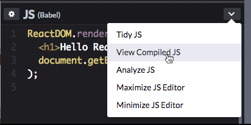
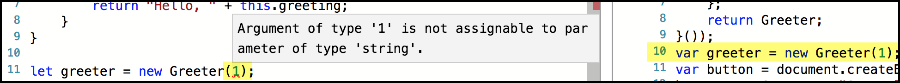
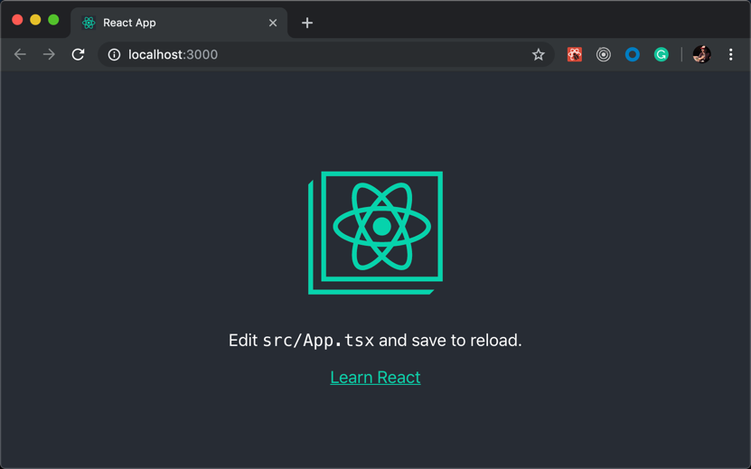
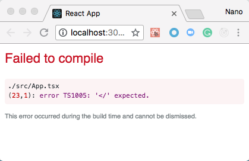
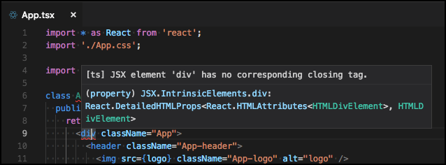
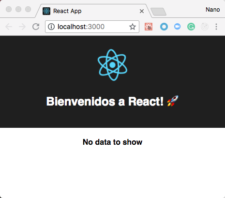
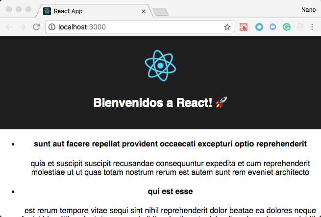
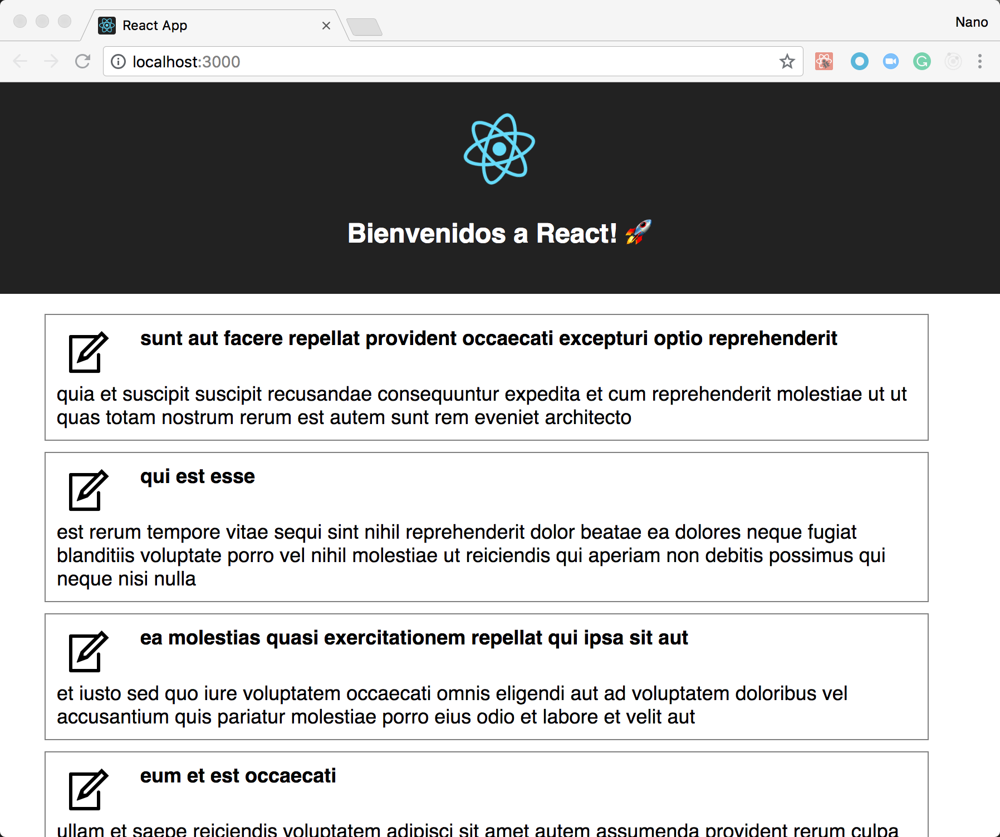

# Introduction to React with TypeScript and its ecosystem

In this Exercise, we will introduce the two core libraries that we will use to develop web applications: [React](https://reactjs.org/) and [TypeScript](https://www.typescriptlang.org/). We will create a basic example to learn the basic concepts by writing code. Finally, we will create a real-life application that will retrieve information from the backend and will store it in the component's state.

Before starting, think about the most common UI layout you've seen and ask yourself the following questions:

1. If I have to implement this, where should I start? Is there something out there that I can use?
1. How can I split the work into different tasks? What are the most important ones?
1. Is it possible to reuse what I'm going to do with other or future projects?


In the next sections, we will work together to propose answers to all of them.

## Introduction: web based development

Before starting, let's do a quick recap of the foundational concepts of web development.

* Web applications are, basically, applications that can be executed by a (web) browser (Chrome, Firefox, Edge, Safari, Internet Explorer, etc).
* Web browser only understand HTML, JavaScript and CSS.
  * HTML provides the basic structure of sites, aka its markup.
  * CSS is used to control presentation, formatting, and layout, aka its styles.
  * JavaScript is used to change the behavior of different HTML elements and CSS styles dynamically, usually depending on the user interaction (e.g., a click of a button, a tap of the finger or even speech).

For instance, when you navigate to the Google site (it's a web application) because you want to search for something:


In this case:
1. The structure of the page is defined using HTML (the text displayed as results, the right section, etc.).
1. How the structure looks is configured using CSS (the green color of the URLs, the design of the results that are videos, etc.).
1. The user interaction is managed with JS code (what happens when we type a question and press ENTER).

The amount of things that we can do in web applications, and the complexity of them, has grown over time. Fortunately, we can use JavaScript libraries to avoid reinventing the wheel and reduce the repetitive work. **React** and **TypeScript** are some of these libraries.

## Section 1: What ReactJS is and what it is for

> **Note:** If you want to know more about ReactJS, go to the official [Getting Started](https://reactjs.org/docs/getting-started.html).

React is a JavaScript library for building user interfaces. One of the many great parts of React is how it makes you think about apps as you build them. It proposes that you should split your pages into pieces, named **components**, following the [single responsibility principle or SRPr](https://en.wikipedia.org/wiki/Single_responsibility_principle): every piece (component) should do only one thing. Using our previous UI layout as an example, we can split the page in (for instance) the following components:

* EntityTableComponent, to display all of our entities.
* SearchComponent, to filter the entities we want to display.
* DetailsComponent, to display information related to a selected entity.
* SidebarPanelComponent, to encapsulate the logic of what we render in the left panel (the links and _PROD_ button).
* ... and so on


The way we split our layout into components is entirely arbitrary and, although it might look hard to do today, will become easier over time. The experience will, in time, tell us what is the best choice in terms of reusability and maintenance.

### React in action

Let's figure out together what the above means by checking the following examples (from the ReactJS documentation):

1. Open the **Hello React!** example by clicking [here](https://codepen.io/nanovazquez/pen/oMYboB).
1. Notice that the code is using _JSX syntax_. Click the button at the right of the _JS (Babel)_ panel and then select _View Compiled JS_ to see the transpiled JavaScript code.

    

    > **What is JSX?** JSX is the de-facto syntax extension to render HTML elements in the React ecosystem. It's not HTML, but the syntax and support is pretty similar. It may remind you of a template language, but it also comes with the full power of JavaScript. If you want to learn more about JSX, see [here](https://reactjs.org/docs/introducing-jsx.html). **Browsers don't understand JSX**. To make our code work in browsers, we need another JS library to _transpile_ our code into JavaScript code that browsers can understand. Or, optionally, write the code that is shown in the compiled view (not recommended).

1. Now, modify the examply by replacing the entire _JS (Babel)_ section with the following code (see the result [here](https://codepen.io/nanovazquez/pen/bjBBLG). Notice that we are merely moving the JSX output to a function.

    ```js
    const Hello = ({ message }) => (
      <h1>{message}</hi>
    );

    ReactDOM.render(
      <Hello message="Hello React!" />,
      document.getElementById('root')
    );
    ```

    > **Props:** React functions can receive arbitrary, read-only input named _props_. These _props_, or simply arguments of the function, define what the function returns. For instance, in our previous example, the message we output is tied to the `message` property. **All React functions & components must act as pure functions with respect to their props.**. This means that the return of the function is only determined by its input values, without "side effects" (we'll see what a React component is later).

1. Now, open the **React Timer** example by clicking [here](https://codepen.io/nanovazquez/pen/RBoabJ).
1. Notice that now we are declaring a `<Timer />` class, that extends from `React.PureComponent`, defines its own state stored in `this.state` and updates it using `this.setState()`.

  > **React.PureComponent?** React lets you define components as classes or functions. When you extend from either _React.Component_ or _React.PureComponent_, you only need to define a **render()**, responsible for returning the JSX elements you want to display for that particular component. Additionally, you will be able to execute code by implementing any of the optional [lifecycle methods](https://reactjs.org/docs/react-component.html#the-component-lifecycle), like `constructor()`, `componentWillMount()`, `componentWillUnmount()`, etc.

  > **State?** Every React Component could store its own local state in `this.state`. State is similar to props, but it is private and fully controlled by the component. **The state MUST NOT be modified directly**. Instead, you should always use `this.setState(newState)`, sending a new object as argument containing _only the keys of the state you want to change_ (it performs a merge). This is because every execution of this method will _potentially_ trigger a new execution of the `render()` method, redrawing the component. If you want to know more about state and lifecycle, see [here](https://reactjs.org/docs/state-and-lifecycle.html).

1. Finally, open the **Questionnaire** example by clicking [here](https://codepen.io/nanovazquez/pen/ajBdXB).
1. Notice that the code shows how to handle user interaction (_"events"_) in a similar way plain JS code does it:

    1. All JSX elements expose a set of events (see all supported events [here](https://reactjs.org/docs/events.html#supported-events)).
    1. We can hook up to each event by attaching a function to it. By default, it will receive a [SyntheticEvent](https://reactjs.org/docs/events.html) object as the first argument, but [you can change this](https://reactjs.org/docs/handling-events.html#passing-arguments-to-event-handlers).

#### Wrapping up

By reviewing these examples, we learned the following:

1. React (usually) the **JSX** to define what we want to display.
1. To customize what we output we can send **props** to our React functions or components.
1. React provides the **React.PureComponent** class to help to encapsulate our code in components.
1. Each React component could have its own **state** to store values locally.
1. You can capture user interactions by hooking a function or class method to a JSX **events**.

## Section 2: What TypeScript adds to the mix

[TypeScript](https://www.typescriptlang.org/) is an open-source library developed and maintained by Microsoft to implement large-scale applications in JavaScript environments. It compiles to plain JavaScript, which runs on any browser, in Node.js, or in any JavaScript engine that supports [ECMAScript](https://en.wikipedia.org/wiki/ECMAScript) 3 (or newer).

In essence, it's a strict syntactical superset of JavaScript that adds optional static typing to the language. The main benefits of using this library are:

* It has static checking and code refactoring and a broad set of highly-productive development tools and practices.
* It lets you write code using the latest features and syntax, without worrying about the browser support (because it will compile to plain JS).
* It won't force you to use TypeScript: you can write JavaScript if you want.
* It is maintained by Microsoft and Google, and it's currently being used by default in Angular.


### TypeScript in action

Let's see how TypeScript works using an example:

1. Open the [TypeScript playground](http://www.typescriptlang.org/play/).
1. In the drop-down located at the left of the page, select the option _Using classes_.
1. Take a minute to understand what is displayed in the playground:
  * In the left panel, there is TypeScript code that defines the `Greeter` class and a button that, when clicked, executes the `greeter.greet()` method of a `Greeter` instance.
  * In the right panel, you can visualize the JavaScript equivalent, that was generated by transpiling the TypeScript code to ES3.
1. Click the **Run** button in the right section of the page. A new tab will be opened, containing a button that says _Say hello_. Click the button and expect for the message to appear.
1. Now, go back to the previous page and put the mouse over the `Greeter` instantiation on _line 11_. Notice that the IDE displays information about its constructor.

    

1. Next, replace the string `"world"` with the number `1`. Notice that now there is an error in the code, showing you that numbers are not allowed as arguments of the constructor. Also, notice that the JavaScript version doesn't show any error.

    

#### Wrapping up

With this simple example, we've learned that:

* TypeScript code can be transpiled to a JavaScript code that any browser can execute.
* TypeScript allows you to define types the same way you define do this in strongly typed languages. You can find its spec [here](https://github.com/Microsoft/TypeScript/blob/master/doc/spec.md).
* All modern IDEs (VSCode, WebStorm, Atom, etc.) support TypeScript and can provide hints and error messages, as well as static analysis (via [tslint](https://palantir.github.io/tslint/)).

> **Note:** for more information, see the TypeScript handbook [here](https://www.typescriptlang.org/docs/handbook/basic-types.html)

## Section 3: Let's create an app

Now that we've covered the basics, It's time to make things real. In this section, we will set up an app and we will add some code to it to get items from an external source (an API).

### Initial setup

For starters, we need a React web app that can run in our laptop. We've seen before that, since both TypeScript and JSX don't run in browsers (we need to transpile the code), there are several tools that we need to configure to code using these libraries but, in the end, get an artifact fully compatible with browsers. Luckily, there are tools in the React ecosystem that preconfigure everything for us. This way, we can **only** focus on our code.

In the following steps, we are going to install the Microsoft's [TypeScript React Starter](https://github.com/Microsoft/TypeScript-React-Starter) app, that was created on top of Facebook's [Create React app](https://github.com/facebook/create-react-app).

> **Note:** We'll cover how to configure the entire build process manually in a future Exercise.

1. In your terminal, run `npx create-react-app my-app --scripts-version=react-scripts-ts`. This command will create a TypeScript application in the folder **my app**. Alternatively, you can use the application located in the **begin** folder of this Exercise.
1. Wait for the process to complete. You should see a message similar to this:

    

1. Browse to the **my-app** folder you've just created and take a minute or two to analyze the folder structure. Notice that you are looking at a fully-functional application:

    ```
    my-app
    ├── README.md
    ├── node_modules
    ├── package.json
    ├── .gitignore
    ├── public
    │   ├── favicon.ico
    │   ├── index.html
    │   └── manifest.json
    └── src
        ├── App.css
        ├── App.js
        ├── App.test.js
        ├── index.css
        ├── index.js
        ├── logo.svg
        └── registerServiceWorker.js
    ```

1. Now, run `npm start`. This command runs the app in development mode, providing an automatic reload if you make changes to the code (a.k.a. [Hot Module replacement](https://webpack.js.org/concepts/hot-module-replacement/)).
1. Open http://localhost:3000 to view the application in the browser.

    

    Congratulations! You've created your first application with React and TypeScript 💃 🕺 👏

1. Let's take it for a spin. Open the app with VSCode or the IDE of your preference and navigate to the **src/App.tsx** folder.

    > **Note:** _Pro tip!_ You can open VSCode pointing to the folder your terminal is by running `code .`. Similarly, you could do the same for Atom with `atom .`. And for Sublime, you can run `subl .`.

1. Take a couple of minutes to analyze the code in this file:

    * At the top, you have some `import` statements. This is the way JavaScript (ES6) import modules to your code. The three statements are different ways to import things, but the most important part is that two of them store the module in a variable for later use, `React` and `logo`. You can learn more about ES6 imports [here](https://developer.mozilla.org/en-US/docs/Web/JavaScript/Reference/Statements/import).
    *  _Line 6_ defines a JS class named `App` that extends from `React.Component`. As we mentioned before, this class is provided by React to help us to split our code into small components, following the [SRP](https://en.wikipedia.org/wiki/Single_responsibility_principle). By only implementing the `render()` method, React can use this class to display something in the browser.
    * Between _lines 9 and 17_ there is JSX code that renders what we saw before in the browser. Notice that the code is almost identical to HTML, except _line 11_, that sets up a URL reference (via import) for the `` tag.
    * Last, _line 22_ exports our `<App />` class to be available elsewhere.

1. With the app running locally (if you have stopped it, run `npm start` in your terminal), modify the code by removing _line 17_ and save your changes. Note that:

    * A compilation error is displayed immediately in the browser.

      

    * An error is displayed in your IDE.

      

1. Fix the error by undoing what you did (the `</div>` closing tag was removed), save your changes and wait for the browser to refresh.
1. Now, open the **src/index.tsx** file. This is the main entry point of the application. The two most important things you need to learn now are:

    * When the app starts, we mount the `<App />` component in the HTML element with ID `root`. This means that the first component to be rendered in the browser is `<App />`.
    * The app is being rendered in the browser via `ReactDOM.render()`, the same way we were doing it in the initial examples.

      ```js
      import * as React from 'react';
      import * as ReactDOM from 'react-dom';
      import App from './App';
      import './index.css';
      import registerServiceWorker from './registerServiceWorker';

      ReactDOM.render(
        <App />,
        document.getElementById('root') as HTMLElement
      );
      registerServiceWorker();
      ```

1. Last, open the **public/index.html** folder. This is the HTML page that is being rendered in the browser. Notice that _line 28_ has a `<div>` element with `root` as id.

#### Wrapping up

In this quick walkthrough, we did the following:

1. We created a fully-functional web app with a single (npm) command in the Terminal.
1. We executed the web application locally and displayed it in the browser.
1. We analyzed the _React + TypeScript_ code of the app, both the main component and the main entry code. And then we reviewed the main HTML code.

Do you remember what we talked about in the introduction? We said that **browsers only understand HTML, JS and CSS**. In this section, we've gone through the files that will output them. In the end, every compiled JS and CSS file will be injected in the **index.html** page, that will be rendered by the browser when users navigate to your page.

Now that we've covered the basics, let's add some logic to our apps:

### How to add new components

We are now going to add new logic to our app by creating new components. For this, we'll use and widely-known pattern for React applications: [Presentational and Container components](https://medium.com/@dan_abramov/smart-and-dumb-components-7ca2f9a7c7d0).

This is a good top-down approach for small/middle-sized apps, as it proposes you to encapsulate all the logic and state in parent (_smart_) components and use their children (_dumb_) to organize the presentational code. Then, you send functions as _props_ to the children to connect user interaction with your code.

First of all, let's create the children:

1. Create a new folder named **components** inside the **src** folder.
1. Now, create two files inside this folder: **AppHero.tsx** and **AppItems.tsx**.
1. Open the **src/components/AppHero.tsx** file and paste the following code:

    ```js
    import * as React from 'react';
    import logo from '../logo.svg';

    interface IProps {
      message: string;
    }

    export default class AppHero extends React.PureComponent<IProps> {
      public render() {
        const { message } = this.props;
        return (
          <header className="App-header">
            
            <h1 className="App-title">{ message }</h1>
          </header>
        );
      }
    }
    ```

1. Then, open the **src/components/AppItems.tsx** file and paste the following code:

    ```js
    import * as React from 'react';

    interface Item {
      id: number;
      title: string;
    }

    interface IProps {
      items?: Item[];
    }

    export default class AppItems extends React.PureComponent<IProps> {

      public render() {
        return (
          <div className="App-items">
            { this.renderItems() }
          </div>
        );
      }
    }
    ```

1. Implement the `renderItems()` method by pasting the following code inside the `AppItems` class.

    ```js
    export default class AppItems extends React.PureComponent<IProps> {

      public renderItems() {
        const { items = [] } = this.props;

        if (!items.length) {
          return (<h4>No data to show</h4>);
        }

        return (
          <ul>
            {
              items.map(item => (
                <li key={item.id}>
                  <h4>{ item.title }</h4>
                  <p>{ item.body }</p>
                </li>
              ))
            }
          </ul>
        )
      }

      ...
    }
    ```

And now, let's modify the parent to consume them properly:

1. Open the **src/App.tsx** file.
1. Replace _line 4_ with the following `import` statements:

    ```js
    import AppHero from './components/AppHero';
    import AppItems from './components/AppItems';
    ```

1. Now, add these two child components as part of the `render()` method of the `<App />` parent component. It should look like the following:

    ```js
    class App extends React.Component {
      public render() {
        return (
          <div className="App">
            <AppHero
              message="Bienvenidos a React! 🚀"
            />
            <AppItems />
          </div>
        );
      }
    }
    ```

The code we've just added renders the following in the browser (you can execute the app by running `npm start` in your terminal):



Now, let's try to get some items and display them using the `<AppItems />` component.

### How to call a backend to get data

1. Create a new folder named **services** inside the **src** folder.
1. Inside the **services** folder, create a file named **postsService.ts** and paste the following code:

    ```js
    function getPosts() {
      return fetch("https://jsonplaceholder.typicode.com/posts")
        .then(response => response.json());
    }

    export default {
      getPosts,
    }
    ```

    This simple code will take advantage of the [Fetch API](https://developer.mozilla.org/en-US/docs/Web/API/Fetch_API) provided by modern browsers to retrieve items from an API for later use.

1. Now, open the **src/App.tsx** file and add the following `import` statement at the top of the file:

    ```js
    import postsService from './services/postsService';
    ```

1. Then, add a constructor in the `App` class to initialize the `items` _state_. Note that TypeScript will ask you to define the type of the _props_ and the _state_. To speed up things, we can use `any`, although for most of the cases it is not recommended.

    ```js
    class App extends React.Component<any, any> {
      constructor(props: any){
        super(props);
        this.state = { items: [] };
      }

      public render() {
        ...
      }
    }
    ```

1. And then send this new _state_ value to the `<AppItems />` child component, by updating the `render()` method with the following code:

    ```js
    public render() {
      const { items } = this.state;
      return (
        <div className="App">
          <AppHero
            message="Bienvenidos a React! 🚀"
          />
          <AppItems
            items={items}
          />
        </div>
      );
    }
    ```


1. Now we have everything we need to call the service. For this, implement the `componentDidMount()` method
of the `<App />` component.

    ```js
    class App extends React.Component<any, any> {
      constructor(props: any){
        ...
      }

      public componentDidMount() {
        return postsService.getPosts()
          .then(posts => this.setState({ items: posts }))
          .catch(() => this.setState({ items: [] }))
      }

      public render() {
        ...
      }
    }
    ```

    This method is invoked automatically by React after a component is mounted (inserted into the DOM's tree) and it's usually used for manipulations of the DOM or to retrieve data from a remote endpoint.

    > **Note:** For more information about this method and React components lifecycle, see [here](https://reactjs.org/docs/react-component.html#componentdidmount).

1. Open the app in the browser by running `npm start` in the terminal and then navigating to http://localhost:3000/. You should see something like this:

    

We are almost there! Now the app retrieves data from the outside world, but our page looks pretty awful. To improve this, replace the content of the **src/App.css** file with the contents of the **App.css** file located inside the assets folder of this exercise. Then, execute the app again and see the result.



Way better, right? 🎉

### Wrapping up

In this section we learned the following:

* How to create new React components and export them for later use.
* How to make calls to a backend service.
* How to consume components and pass data to them via props.
* How to update the style of our apps using CSS.
