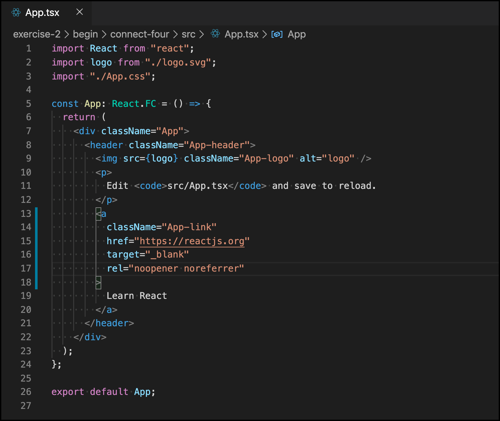
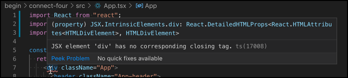
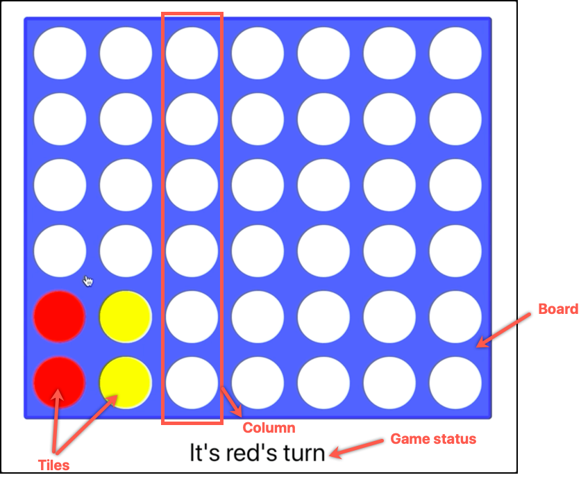

# Creando tu primera app con React y TypeScript

Ahora que hemos aprendido los conceptos básicos, es hora de hacer cosas de verdad. En este ejercicio, configuraremos una aplicación desde cero y luego escribiremos código para implementar un juego, [Connect Four](https://en.wikipedia.org/wiki/Connect_Four), siguiendo un tutorial paso a paso que también nos ayudará a aprender mientras codeamos. Para esto, crearemos una aplicación _real-life_.


Estas preparado/a? 👾

### Configuracion Inicial

> **Nota:** Podes omitir los pasos 1-5 y usar la aplicación ubicada en la carpeta **begin** de este Ejercicio. Recorda usar `npm install` antes de ejecutarlo.

Hemos visto eso antes, ya que TypeScript y JSX no se ejecutan en los navegadores, necesitamos compilar el código que escribiremos en nuestra aplicación. Para lograr esto, tendremos que presentar, explicar y configurar varias herramientas (Webpack/Rollup, Babel/tsconfig, Módulos CSS, etc.). O podemos aprovechar los scaffolders, que son aplicaciones que tienen esto ya cocinado (también llamadas _integrated toolchains_), están preconfiguradas y no requieren ninguna configuración extra para comenzar, lo que nos permite concentrarnos **solo** en nuestro código.

En estos pasos, vamos a instalar la aplicación de Facebook [Create React app](https://github.com/facebook/create-react-app), la herramienta de facto para construir una aplicación React.

1. En tu terminal, corre el comando `npx create-react-app connect-four --typescript`. Este comando va a crear una aplicacion Typescript dentro de la carpeta **connect-four**.

> **Nota:** Si `npx` no funciona, proba con `npm i -g create-react-app` seguido de `create-react-app connect-four --typescript`.

1. Espera a que se complete el proceso. Deberías ver un mensaje similar a este:


1. Navega la carpeta **connect-four** que se acaba de crear y tomate un minuto o dos para analizar la estructura de la carpeta. Estás viendo una aplicación totalmente funcional con lógica de negocios dentro de la carpeta **src**:

   ```
   connect-four
   ├── node_modules
   │   ├── ...
   ├── public
   │   ├── favicon.ico
   │   ├── index.html
   │   └── manifest.json
   │   └── ...
   ├── src
   │   ├── App.css
   │   ├── App.test.tsx
   │   ├── App.tsx
   │   ├── index.css
   │   ├── index.tsx
   │   ├── logo.svg
   │   └── react-app-env.d.ts
   │   └── serviceWorker.ts
   ├── .gitignore
   ├── package-lock.json
   ├── package.json
   ├── README.md
   ├── tsconfig.json
   └── ...
   ```

1. Ejecuta `npm start`. Este comando ejecuta la aplicación en modo de desarrollo, proporcionando una recarga automática si realiza cambios en el código (a.k.a. [Hot Module replacement](https://webpack.js.org/concepts/hot-module-replacement/)).
1. Visita http://localhost:3000 para ver la aplicación corriendo en el navegador.


💃 🕺 👏 Felicidades! 👏 🕺 💃 <br/>
Creaste tu primera aplicacion con React y Typescript

1. Investiguemos cómo está hecha. Abri la aplicación con VSCode o el IDE de tu preferencia y navegue a la carpeta **src/App.tsx**.

   

   > **Nota:** _Pro tip!_ Se puede abrir VSCode usando la terminal ejecutando `code .` en la carpeta donde este el codigo. Del mismo modo, podría hacer lo mismo para Atom con `atom .`. Y para Sublime, puede ejecutar `subl .`.

1. Tomate un par de minutos para analizar el código de este archivo:

   - En la parte superior, tenes algunas declaraciones `import`. Esta es la forma en que JavaScript (ES6) importa módulos al código. El valor importado se almacena dentro de una variable para su uso posterior. Podes obtener más información sobre los _imports_ de ES6 [aquí](https://developer.mozilla.org/en-US/docs/Web/JavaScript/Reference/Statements/import).
   - _Linea 5_ define un componente funcional React llamado `App`. Devuelve el código JSX que el navegador dibuja (después de compilar). Recuerde que los componentes React nos ayudan a dividir nuestro código en partes pequeñas, siguiendo [SRP](https://en.wikipedia.org/wiki/Single_responsibility_principle).
   - Entre las líneas 6 y 23 hay código JSX que renderiza lo que vimos antes en el navegador. Observe que es casi idéntico al HTML, excepto _linea 9_ que configura la prop _src_ utilizando una referencia de variable de JavaScript (``)
   - Por último, _linea 26_ exporta nuestra función `<App />` para que esté disponible para su uso en otros lugares.

1) Con la aplicación ejecutándose localmente (si la deteniste, ejecuta `npm start` en la terminal), modifica el código eliminando la _linea 17_ y guarda tus cambios. Tene en cuenta que:

   - El IDE muestra un error:



- El navegador también muestra el error de compilación:


1. Soluciona el error deshaciendo lo que hicimos (eliminamos la etiqueta de cierre `</div>`), guarda los cambios y espera a que el navegador actualice la aplicación.
1. Abri el archivo **src/index.tsx**. Este es el principal punto de entrada de la aplicación. Las dos cosas más importantes que necesita aprender ahora son:

```js
import React from "react";
import ReactDOM from "react-dom";
import App from "./App";

ReactDOM.render(<App />, document.getElementById("root"));
```

- Cuando se inicia la aplicación, "montamos" el componente `<App />` en el elemento HTML con ID `root`. Esto significa que el primer componente que se renderiza en el navegador es `<App />`.
- El método `ReactDOM.render()` renderiza el componente `<App />` en el navegador, dentro del elemento "root" `<div>`, como en los ejemplos iniciales. _Esta es la magia de React_. No importa si la aplicación que vas a construir es básica o compleja, el código para procesarla es el mismo.

1. Por último, abri la carpeta **public/index.html**. Este archivo tiene el código HTML que renderiza el navegador. Observe que la _linea 31_ tiene un elemento vacío `<div id="root"></div>`. Es donde se "montará" su aplicación, lo que significa que el código de su aplicación se inyectará en este elemento HTML.

#### Resumiendo

En este rápido tutorial, hicimos lo siguiente:

1. Creamos una aplicación web completamente funcional con un solo comando (npm) en la Terminal.
1. Ejecutamos la aplicación web localmente y la mostramos en el navegador.
1. Analizamos el código _React + TypeScript_ de la aplicación, tanto el componente principal como el código de entrada principal. Y luego, revisamos el código HTML principal.

Recuerde que los navegadores **solo entienden HTML, JS y CSS**. Esta aplicación tiene un proceso **build** que generará archivos JS y CSS dentro de la carpeta _dist_. Se hará referencia a estos archivos en un archivo **index.html** (también generado). Y este archivo será analizado, leído e interpretado por el navegador.

### Cómo agregar nuevos componentes

Ahora que entendemos las bases de nuestra aplicación, es hora de agregar la lógica del juego. Como explicamos en el [Ejercicio 1](../exercise/1), las aplicaciones React dividen la lógica de negocios en diferentes componentes. Pero hay diferentes responsabilidades en una aplicación. Utilizaremos un patrón ampliamente conocido, [Presentational and Container components](https://medium.com/@dan_abramov/smart-and-dumb-components-7ca2f9a7c7d0), para organizar nuestros componentes en una estructura simple, pero potente:


Esta técnica propone encapsular toda la lógica de negocio y su estado en componentes padres (_Container_, o _Smart_) y usar sus componentes secundarios (_Presentational_, o _Dumb_) para organizar el código a cargo de las visuales. Utiliza las **props** para enviar información a los hijos, a cargo de renderizar la aplicación, y para conectar la interacción del usuario con las funciones de los padres.

> **Nota:** dado que la aplicación terminará en cascada de información de arriba hacia abajo, este enfoque es el más adecuado para aplicaciones pequeñas/medianas. Las aplicaciones grandes compuestas de una jerarquía profundamente anidada requieren diferentes tratamientos que veremos en el próximo ejercicio.

Siguiendo esta técnica, podemos identificar las siguientes entidades:

- Un componente **App**, encargado de almacenar el estado de la aplicación. Y para calcular quién es el ganador. Es el componente "padre"/"container"/"smart".
- Un componente **Board**, responsable de dibujar los elementos del juego, el "children"/"presentational"/"dumb".
- El tablero está compuesto de múltiples **Columns** compuestas de diferentes **Tiles** que pueden tener o no un chip. Cuando se hace click en una columna, se agrega un nuevo chip en un mosaico vacío en la parte inferior. Esto es parte de la lógica de negocios de la aplicación.



> **Nota:** Por supuesto, la estructura va a variar segun tu preferencia. _Podes pensar una manera distinta de organizar tu codigo?_

#### Creando el componente Tile

1. Crea una nueva carpeta llamada **components** dentro de la carpeta **src**.
1. Dentro de esta carpeta, crea un archivo **index.ts**. Lo usaremos para exponer los componentes que queremos que estén disponibles públicamente fuera de esta carpeta.
1. Crea una carpeta llamada **Tile** y dentro los siguientes archivos: un archivo **Tile.module.css** para almacenar el código CSS, un archivo **Tile.tsx** para la lógica y un archivo **types.ts** para los tipos.
1. Abri el archivo **src/components/Tile/types.ts** y pega el siguiente código. Este código define la interfaz (o contrato) de nuestro componente tipando sus props.

```ts
export interface Props {
  id: string;
  chipType?: string;
  onClick: (id: string) => any;
}
```

Con este código, le estamos diciendo al quien use el componente que:

1. Tienen que proporcionar un `id` a través de los props del componente.
1. Pueden enviar un `chipType` al componente. Como mencionamos anteriormente, las fichas pueden tener un chip o estar vacías.
1. Tienen que adjuntar una función al accesorio `onClick`, para activar el código al hacer click en un **Tile**.

1. Luego, abri el archivo **src/components/Tile.tsx** y pega el siguiente código:

```js
import React from "react";
import classNames from "classnames";
import styles from "./Tile.module.css";
import { Props } from "./types";

export default class Tile extends React.PureComponent<Props> {
  render() {
    const { id, chipType, onClick = () => {} } = this.props;
    const chipCssClass = classNames(
      styles.chip,
      chipType === "red" ? styles.red : styles.yellow
    );

    return (
      <div className={styles.tile} onClick={() => onClick(id)}>
        {chipType && <div className={chipCssClass} />}
      </div>
    );
  }
}
```

El componente **Tile** es un componente _dumb_ encargado de dibujar mosaicos en el tablero, que puede tener o no un chip en su interior. Decidimos si un chip está presente comprobando el valor del accesorio `chipType`. Coloreamos el chip con CSS. Tene en cuenta que, cuando se hace click, activamos la función `onClick` (recibida a través de props) con la `id` de **Tile** como parámetro.

> **Nota:** ¿Notaste que adjuntamos la interfaz **Props** a la definición `React.PureComponent`? Así es como se escribe la clase React. Un IDE entenderá esto y le dirá la forma de las propiedades de los componentes si pasa el cursor por `this.props`. ¡Dale una oportunidad!

1. Por ultimo, abri **src/components/Tile.css** y pega el siguiente codigo CSS:

```css
.tile {
  width: 75px;
  height: 75px;
  border: solid 10px #3355ff;
  border-radius: 100%;
  background-color: white;
}

.chip {
  width: 75px;
  height: 75px;
  border-radius: 100%;
  background-color: gray;
}

.yellow {
  background-color: #ffff33;
}

.red {
  background-color: #ff010b;
}
```

> **Nota:** Create React app trata los archivos CSS con el `[nombre].module.css` de una manera distinta a un archivo CSS normal, al compilarlo usa la libreria [CSS Modules](https://github.com/css-modules/css-modules). Uno de los principales beneficios es que permite usar el mismo nombre de clase CSS en diferentes archivos, sin preocuparse por los conflictos de nombres, al reemplazar automáticamente sus nombres de clase CSS con un nombre de clase "único" del formato [filename]\_[classname]\_\_[hash].
>
> Para obtener más información, hace click [aquí](https://create-react-app.dev/docs/adding-a-css-modules-stylesheet).

#### Creando el componente Column

1. Navega la carpeta **components** y crea una nueva carpeta **Column**.
1. Dentro de esta carpeta, crea los siguientes archivos: un archivo **Column.module.css** para almacenar el código CSS, un archivo **Column.tsx** para la lógica y **types.ts** para tipar al componente usando Typescript.
1. Abri el archivo **src/components/Column/types.ts** y pega el siguiente código que define las props (contrato) del componente _Column_:

```js
import { ChipsPositions } from "../App/types";

export interface Props {
  column: number;
  rows: number;
  chipsPositions: ChipsPositions;
  onTileClick: (id: string) => any;
}
```

Con este código, estamos definiendo que:

- Necesitamos proporcionar un número de `column`. Este valor actúa como la ID del elemento.
- También necesitamos decirle al componente cuántas `rows` tendrá.
- El accesorio `chipsPositions` es un objeto que conoce la posición de cada chip. Veremos cómo se construye este objeto más adelante. Por ahora, solo necesita saber que puede decirnos si hay un chip dentro de un **Tile** o no.
- Por último, la función `onTileClick` se usa para informar al padre cuando el usuario hace click en un mosaico específico.

1. Abri **src/components/Column.tsx** y pega el siguiente codigo presentacional:

```js
import React from "react";
import Tile from "../Tile/Tile";

import styles from "./Column.module.css";
import { Props } from "./types";

export default class Column extends React.PureComponent<Props> {
  render() {
    const { column, rows, chipsPositions, onTileClick } = this.props;
    const tiles = [];

    for (let row = 0; row < rows; row++) {
      const tileId = `${row}:${column}`;
      const chipType = chipsPositions[tileId];
      tiles.push(
        <Tile
          key={tileId}
          id={tileId}
          chipType={chipType}
          onClick={onTileClick}
        />
      );
    }

    return <div className={styles.column}>{tiles}</div>;
  }
}
```

Como se puede ver arriba, lo que hacemos aquí es renderizar un elemento `<div>` que contiene tantos componentes **Tile** como filas. Cada mosaico recibirá un `chipType` que puede tener un valor o no. Y la función `onTileClick()` se activará al hacer click. Observe que definimos el `tileId` como la combinación de un valor de fila y columna. Y este valor es único.

1. Abri **src/components/Column/Column.module.css** y pega el siguiente codigo CSS:

```css
.column {
  display: flex;
  flex-direction: column;
  cursor: pointer;
}
```

#### Creando el componente Board

1. Del mismo modo, navega la carpeta **components** y crea una nueva carpeta **Board**.
1. Dentro de esta carpeta, crea los siguientes archivos: un archivo **Board.module.css** para almacenar el código CSS, un archivo **Board.tsx** para la lógica y **types.ts** para tipar al componente usando Typescript.
1. Abri el archivo **src/components/Board/types.ts** y pega el siguiente código que define las props (contrato) del componente _Board_:

```js
import { ChipsPositions } from "../App/types";

export interface Props {
  columns: number;
  rows: number;
  chipsPositions: ChipsPositions;
  onTileClick: (id: string) => any;
}
```

Este código le dice al que use al componente que:

- Tiene que proporcionar el número de `columns` y `rows` que tendrá el tablero.
- Tiene que enviar el objeto `chipsPositions`. Esta información es utilizada por el componente **Column**, no por el **Board**.
- Tiene que proporcionar una función `onTileClick`, que será utilizada por el componente **Tile** para señalar cuando se hace click.

1. Abri **src/components/Board.tsx** y pega el siguiente codigo:

```js
import React from "react";
import Column from "../Column/Column";

import styles from "./Board.module.css";
import { Props } from "./types";

export default class Board extends React.PureComponent<Props> {
  renderColumns() {
    const { columns, rows, chipsPositions, onTileClick } = this.props;

    const columnsComponents = [];

    for (let column = 0; column < columns; column++) {
      columnsComponents.push(
        <Column
          key={column}
          column={column}
          rows={rows}
          chipsPositions={chipsPositions}
          onTileClick={onTileClick}
        />
      );
    }

    return <>{columnsComponents}</>;
  }

  render() {
    return <div className={styles.board}>{this.renderColumns()}</div>;
  }
}
```

Este código es similar al componente Column, pero en lugar de crear Tiles, creamos múltiples columnas, les pasamos la información requerida y luego mostramos el resultado. La única diferencia es que usamos un método `this.renderColumns()` para encapsular esta lógica.

> **Nota:** _Notaste que también usamos React.Fragment?_ Probablemente no porque estamos usando la abreviado `<> </>`. Es un equivalente de `<React.Fragment></React.Fragment>`.

1. Por ultimo, abri **src/components/Board/Board.module.css** y pega el siguiente codigo:

```css
.board {
  display: flex;
  flex-direction: row;
  border: solid 5px #002bff;
  border-radius: 5px;
  background-color: #3355ff;
}

.columns {
  display: flex;
  flex-direction: row;
}
```

Ya casi estamos! 🙌

#### Creando el componente App

Ahora vamos a desarrollar la lógica principal de nuestro juego. Presta especial atención a esta sección:

1. Crea una carpeta llamada **App** dentro de la carpeta **src/components**.
1. Dentro de esta carpeta, crea el archivo **App.module.css**, el archivo **App.tsx** y el archivo **types.ts**.
1. Abri el archivo **src/components/App/types.ts** y pega la siguiente información:

```js
export interface ChipsPositions {
  [key: string]: Player;
}

type Player = "red" | "yellow" | "";

export interface Props {
  columns: number;
  rows: number;
}

export interface State {
  chipsPositions: ChipsPositions;
  gameStatus: string;
  playerTurn: Player;
}
```

Aquí definimos varias cosas importantes:

- La forma del objeto `ChipsPositions`: un diccionario que contiene en cada posición uno de estos valores de tipo (`Player`): `"red "`, `"yellow"` o `""` (que representa un estado vacío).
- Definimos la forma de los `Props` y `State` de la aplicación. El primero nos dice que debemos proporcionar la cantidad de `columns` y `rows` para que el componente de la aplicación se inicialice. Mientras que este último nos dice toda la información que almacenará el componente.

1. Abri **src/components/App/App.tsx** y pega lo siguiente:

```js
import React from "react";
import Board from "../Board/Board";

import { Props, State, ChipsPositions } from "./types";
import styles from "./App.module.css";

export default class App extends React.PureComponent<Props, State> {
  state: State = {
    chipsPositions: {},
    playerTurn: "red",
    gameStatus: "It's red's turn"
  };

  calculateGameStatus = (
    playerTurn: string,
    chipsPositions: ChipsPositions
  ): string => {
    // TODO
  };

  handleTileClick = (tileId: string) => {
    // TODO
  };

  renderBoard() {
    const { columns, rows } = this.props;
    const { chipsPositions } = this.state;
    return (
      <Board
        columns={columns}
        rows={rows}
        chipsPositions={chipsPositions}
        onTileClick={this.handleTileClick}
      />
    );
  }

  renderStatusMessage() {
    const { gameStatus } = this.state;
    return <div className={styles.statusMessage}>{gameStatus}</div>;
  }

  render() {
    return (
      <div className={styles.app}>
        {this.renderBoard()}
        {this.renderStatusMessage()}
      </div>
    );
  }
}
```

Esta es la estructura básica de la aplicación. Ya sabemos lo que esto significa. Este es el código "presentacional" para dibujar/renderizar el **Board** y el mensaje **Status**. También estamos inicializando el estado de la **App** con información predeterminada. Este código es completamente funcional, pero no hará nada cuando el usuario interactúe con el tablero.

1. Para eso tenemos que implementar el metodo `handleTileClick()` que reacicona cuando un usuario hace click en un **Tile**.

```js
handleTileClick = (tileId: string) => {
  const { chipsPositions, playerTurn } = this.state;

  // Get the last empty tile of the column
  const column = parseInt(tileId.split(":")[1]);
  let lastEmptyTileId = this.getLastEmptyTile(column);

  // If there is no empty tile in the column, do nothing
  if (!lastEmptyTileId) {
    return;
  }

  // Add chip to empty tile
  const newChipsPositions = {
    ...chipsPositions,
    [lastEmptyTileId]: playerTurn
  };

  // Change player turn
  const newPlayerTurn = playerTurn === "red" ? "yellow" : "red";

  // Calculate game status
  const gameStatus = this.calculateGameStatus(newPlayerTurn, newChipsPositions);

  // Save new state
  this.setState({ chipsPositions: newChipsPositions, playerTurn: newPlayerTurn, gameStatus });
};

getLastEmptyTile(column: number) {
  const { rows } = this.props;
  const { chipsPositions } = this.state;

  for (let row = rows - 1; row >= 0; row--) {
    const tileId = `${row}:${column}`;
    if (!chipsPositions[tileId]) {
      return tileId;
    }
  }
}
```

Tomate un par de minutos para entender lo que estamos haciendo:

1. Primero, necesitamos obtener el último **Tile** vacío de la columna (de arriba a abajo) al que pertenece el mosaico en el que se hizo click. Obtenemos el número de columna analizando el `tileId`. Tenga en cuenta que al eliminar este código, podemos colocar un chip en cualquier mosaico, pero eso cambiará las reglas del juego.
1. Luego, agregamos una ficha al mosaico seleccionado dependiendo del turno del jugador, conocido solo por el componente **App**. Y recalculamos el estado del juego.
1. Por último, almacenamos toda la información nueva en el estado del componente, volviendo a renderizar la aplicación completa si algo cambia (React se encargará de decidir esto).

1. Implementamos el método `CalculateGameStatus()` pegando el siguiente código dentro del componente **App**. Contiene la lógica del juego para decidir quién es el ganador o quién juega a continuación. Vamos a saltear la explicación.

```js
calculateGameStatus = (
  playerTurn: string,
  chipsPositions: ChipsPositions
): string => {
  const { columns, rows } = this.props;

  // Check four in a row horizontally
  for (let row = 0; row < rows; row++) {
    let repetitionCountStatus = { playerChip: "", count: 0 };

    for (let column = 0; column < columns; column++) {
      const chip = chipsPositions[`${row}:${column}`];

      // If there is a chip in that position, and belongs to a player
      // count that chip for that player (either increase the count or start over)
      if (chip && chip === repetitionCountStatus.playerChip) {
        repetitionCountStatus.count++;
      } else {
        repetitionCountStatus = { playerChip: chip, count: 1 };
      }

      // If the count for a player is 4, that player won
      if (repetitionCountStatus.count === 4) {
        return `Player ${repetitionCountStatus.playerChip} won!`;
      }
    }
  }

  // Check four in a row vertically
  for (let column = 0; column < columns; column++) {
    let repetitionCountStatus = { playerChip: "", count: 0 };

    for (let row = 0; row < rows; row++) {
      const chip = chipsPositions[`${row}:${column}`];

      // If there is a chip in that position, and belongs to a player
      // count that chip for that player (either increase the count or start over)
      if (chip && chip === repetitionCountStatus.playerChip) {
        repetitionCountStatus.count++;
      } else {
        repetitionCountStatus = { playerChip: chip, count: 1 };
      }

      // If the count for a player is 4, that player won
      if (repetitionCountStatus.count === 4) {
        return `Player ${repetitionCountStatus.playerChip} won!`;
      }
    }
  }

  // TODO: Check four in a row diagonally

  return `It's ${playerTurn}'s turn`;
};
```

> **Nota:** Tene en cuenta que este código no verifica cuatro chips consecutivos del mismo valor en diagonal. _¿Podes pensar alguna implementación para esto? Si te animas, envíemela [como una Pull Request!](https://help.github.com/en/articles/creating-a-pull-request)_.

#### Inicializando la App

1. Abri **src/components/index.ts** y pegue esta línea para exponer el componente **App** fuera de la carpeta **components**.

```js
export { default as App } from "./App/App";
```

1. Ahora abri **src/index.tsx** y reemplaza su contenido con el siguiente codigo:

```js
import React from "react";
import ReactDOM from "react-dom";
import { App } from "./components";
import "./index.css";

ReactDOM.render(<App columns={7} rows={6} />, document.getElementById("root"));
```

1. Si aún no lo ha hecho, inicie la aplicación ejecutando `npm start` en una terminal.
1. En la ventana del navegador recién abierta, abra la **Developer Console** y luego haga clic en la pestaña **Components**. Verá aquí el árbol de jerarquía de la aplicación React, compuesto por un componente **App**, un componente **Board** con múltiples componentes **Column** y componentes **Tile**.
1. Juga un poco y despues comproba los diferentes **Tile**s del tablero. Tene en cuenta que las propiedades recibidas cambiarán cuando interactúes con ellas.


> **Nota:** También se puede cambiar una prop directamente modificando su valor en el panel derecho. Pruébelo usted mismo cambiando el tipo de chip de un **Tile** de `"red"` o `undefined` a `"yellow"`.

¡Felicidades! Has creado tu primer juego con React y TypeScript 🎉

### Resumiendo

En este ejercicio, aprendimos lo siguiente:

- Cómo crear una aplicación desde cero usando React y TypeScript.
- Cómo dividir la lógica empresarial de su aplicación en pequeños componentes.
- Cómo enviar información y notificar eventos de usuarios a través de props.
- Cómo usar las herramientas React Developer para visualizar el árbol de componentes de su aplicación y su estado.
