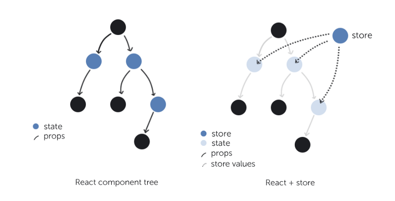
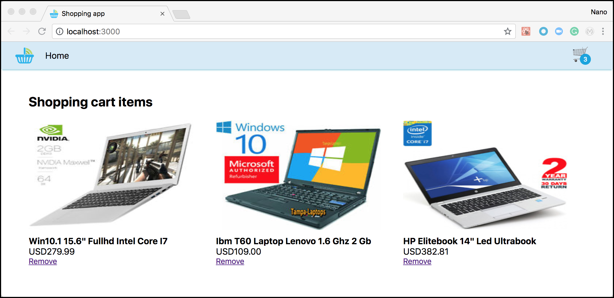

# State management

In this exercise, we will review what we've done in the previous exercise and try to analyze together the limitations of the strategy used to handle state (Parent-Child components and component state). Then, we will propose another tactic best-suited for medium/large applications (Redux), and we'll try to study the tradeoffs of this new approach.

## Section 1: A quick recap

> **Note:** for this exercise, you need [Redux devtools in your browser](https://github.com/zalmoxisus/redux-devtools-extension#installation). Follow the steps in the link and install it before continuing with this section.

Let's talk first about what we learned so far. We know that a React application consists of a set of **components** that receive of a set of input, read-only **props** and produce **JSX** code with them. If any of this properties change, new **JSX** may be generated. When users interact with your components, information is passed to the upper levels by executing functions also received via **props**, following the [container and presentational components pattern](https://medium.com/@dan_abramov/smart-and-dumb-components-7ca2f9a7c7d0).

Take a minute to understand the above paragraph. It can be summarized in these two sentences

* In React, **data is unidirectional**, meaning that it flows in one direction, from parent to child.
* User interaction is translated into **events** that execute our custom code.


### And what about the state?

In Exercise 1, we saw that you could store local state using `this.state` and `this.setState()` and, following the [container and presentational components pattern](https://medium.com/@dan_abramov/smart-and-dumb-components-7ca2f9a7c7d0), it's best to centralize this information in a parent component. Now, you should be smart about this, as `this.setState()` would potentially execute a `render()`, **repainting the component and its children**.

Consider the following component structure:

* We have a root component, **A**, in charge of rendering three children: **A.0**, **A.1** and **A.2**.
* Similarly, **A.0** is composed of two components: **A.0.0** and **A.0.1**.
* We did things


Now let's analyze the following scenarios:

1. Let's say that we followed the [container and presentational components pattern](https://medium.com/@dan_abramov/smart-and-dumb-components-7ca2f9a7c7d0) to the letter and all the logic is held in the **A** parent component (smart) and the rest are just presentational (dumb).

    

    - When user interactions update the state, the `this.setState()` will be executed at the root level, _forcing a re-render of all five children components_, even if we need only one to change.
    - This behavior of React components, the need to re-render the component and its children, is called **cascading rendering** (or _cascading updates_).
    - It's easy to understand that, by using this approach, performance is lost in favor of code organization.

1. Now, let's say we move some state to **A0**, only causing the re-render of its two children when the `this.setState()` is called.

    

    - This approach **improves the cascading rendering situation a little bit**, only re-rendering two components instead of five when, let's say, we need only one to render.
    - The tradeoff is that we have to split the logic and move it to other places, but this works with short numbers.

Notice that this is just a simple example. You can imagine that a real-world application has dozens of components and having to make this analysis several times in certainly an overkill. At this point you should be asking yourself, is there something that would help me to simplify the state management, avoiding the loss of performance due to the cascading rendering and, at the same time, unifying all the logic in a single place.

There should be a better way, right?

## Section 2: State management

[Redux](https://redux.js.org/introduction/threeprinciples) is a simple library that proposes a very simple approach to manage your state. Although it introduces several new concepts, it can be described in three core concepts (that we already know about):

* **Single source of truth**: The state of your whole application is stored in an object tree within a single store.
* **State is read-only**: The only way to change the state is to emit an action, an object describing what happened.
* **Changes are made with pure functions**: To specify how the state tree is transformed by actions, you write pure reducers.



In the following section, we will go through the steps needed to migrate from the local component state management to Redux. For this, we will use a simple shopping cart application.

> **Note:** There is a lot to learn about Redux and this course could not cover everything. If you want to know more, we suggest that you should start from the [basics](https://redux.js.org/basics).

### The Shopping cart app

1. Open the _Shopping cart app_ located in the **begin/shopping-app** folder of this Exercise.
1. In the terminal, and navigate to the root folder and run `npm i` to install all the dependencies.
1. While this command is being executed, take a few minutes to analyze the folder structure and the main components.

    - First, we have a _src/index.tsx_ file, the entry point of our app, in charge of rendering the main `<App />` component in the DOM node.
    - The `<App />` component (_src/components/App/index.tsx_ file) holds the main logic of this app, and following the [container and presentational components pattern](https://medium.com/@dan_abramov/smart-and-dumb-components-7ca2f9a7c7d0), it's in charge of several things, from displaying the displaying the main presentational components to reacting to user interaction.
    - Then we have two presentational components, `<TopBar />` and `<ShoppingCart />`, that receive everything they need from its parent.
    - Finally, notice that the `<TopBar />` component has sub-components, with clear responsibilities.

1. After everything is installed, open the terminal in the root folder of the app run `npm start`. Click the _Remove_ button and see that both the list and the count indicator at the top right are affected by this.

    

Notice that the scenario proposed is similar to what we discussed before. To sum it up, if something changes in the `<ShoppingCart />` component, we will re-render everything (although, in this case, we need it). In the next step, we will install Redux and move some of the logic of the `<App />` component to somewhere else.

### Migrating to Redux

1. Let's start by installing the packages we need. We'll go through all of them later, for now, just run `npm i -S redux react-redux redux-actions redux-thunk-promise`.
1. Ant their definition files: `npm i -D @types/redux @types/react-redux @types/redux-actions`.

    > **Note:** A definition file contains the types and declarations of a particular JS library that was not written in TypeScript. They are part of the [open-source project Definitely typed](https://github.com/DefinitelyTyped/DefinitelyTyped), maintained by the TS community that, as of today, has more than 4000 definition files.

1. Now, create a folder named **domains** inside the **src** folder. We'll save all of our _data-domain related_ files there.
1. Currently, we only have one domain, _user_. In this data-domain, we need to store:

    * The current user ID
    * The user's shopping cart items.

  Therefore, create a folder named **user** inside the **src/domain** folder.

1. We'll need to create some files to manage different responsibilities. We'll start by creating an **actions.ts** file for our app's actions creators. _What is an action creator?_ a function that returns/creates actions.

    Paste the following JS code inside the **src/domains/user/actions.ts** file. This code defines two actions, one sync and other async.

    ```js
    import { createAction } from 'redux-actions';
    import usersService from '../../services/users-service';

    const FETCH_SHOPPING_CART_ITEMS = 'FETCH_SHOPPING_CART_ITEMS';
    const REMOVE_SHOPPING_CART_ITEM = 'REMOVE_SHOPPING_CART_ITEM';

    export default {
      FETCH_SHOPPING_CART_ITEMS,
      REMOVE_SHOPPING_CART_ITEM,
      fetchShoppingCartItems: createAction(FETCH_SHOPPING_CART_ITEMS, usersService.getUserShoppingCartItems),
      removeShoppingCartItem: createAction(REMOVE_SHOPPING_CART_ITEM),
    };
    ```

    > **Note:** Actions are plain JavaScript objects that have a `type` property that indicates the type of action being performed. They are payloads of information that _dispatch_ (send) from your application to your store. You can learn more about actions [here](https://redux.js.org/basics/actions).

1. Next, we'll create the user's reducers. They are in charge of modeling our new app's state after receiving user action. Since we defined two actions, it makes sense to define two reducers. Paste the following code in a filed named **reducers.ts**, located inside the **src/domains/user** folder:

    Note that:
    * We define an initial state, similar to what we have in the `<App />` component.
    * We don't mutate the state. Instead, we create a copy of it.
    * We only change what we want to change. The rest remains the same.

    ```js
    import { handleActions } from 'redux-actions';
    import actions from './actions';

    const initialState = {
      shoppingCartItems: [],
      userId: 'user-id',
    };

    export default handleActions({
      [actions.FETCH_SHOPPING_CART_ITEMS]: (state: any, action: any) => {
        const items = action.payload;
        return {
          ...state,
          shoppingCartItems: items,
        };
      },

      [actions.REMOVE_SHOPPING_CART_ITEM]: (state: any, action: any) => {
        const itemToRemoveId = action.payload as string;
        const filteredItems = state.shoppingCartItems.filter((item: any) => item.id !== itemToRemoveId)

        return {
          ...state,
          shoppingCartItems: filteredItems
        };
      },
    }, initialState);
    ```

    > **Note:** Reducers specify how the application's state changes in response to actions sent to the store. Remember that actions only describe what happened, but don't model how the application's state changes. Find out more about them [here](https://redux.js.org/basics/reducers).

1. Last, create an **index.ts** file inside the **src/domains** folder and paste the following code. This file wraps up everything we did to consume it easily from the outside.

    ```js
    import userActions from './user/actions';
    import userReducers from './user/reducers';

    const actions = {
      ...userActions,
    };

    const reducers = {
      user: userReducers,
    };

    export {
      actions,
      reducers,
    };
    ```

    > **Note:** Did you notice that you are wrapping your user's reducers in the `user` property? This will be the state's node in which all the user information will go. Future state, like products or categories, would use different nodes. If you've followed this convention, you've probably noticed that you'll just only need to copy and paste the user's folder for that.

Next, we need to do some modifications to the `<App />` component. These changes will be mostly refactoring/simplifications because we are moving the state management logic away from it.

1. Open the **src/components/App/types.ts** file and replace the `IProps` and `IState` interfaces with the following code. Note that we are merging these two interfaces because we will receive everything via `props`, including the `actions`.

    ```js
    export interface IProps {
      shoppingCartItems: IProduct[];
      userId: string;
      fetchUserShoppingCartItems: (userId: string) => Promise<IProduct[]>;
      onRemoveShoppingCartItem: (itemId: string) => any;
    }
    ```

1. Now, rename the **src/components/App/index.ts** file to **src/components/App/App.ts** file. And apply the following changes to this file:

    1. First of all, replace the import of files with `import { IProps } from './types';`. Then update the class definition with `class App extends React.Component<IProps, {}>`.
    1. Notice that we are not using state anymore. Remove the line in the `constructor()` that initializes it. It should now look like the following:

        ```js
        class App extends React.Component<IProps, {}> {
          constructor(props: any) {
            super(props);
          }
          ...
        }
        ```

    1. Then, replace the `handleRemoveShoppingCartItem()` method with the following code that simply fires an `action`:

        ```js
        public handleRemoveShoppingCartItem = (itemToRemoveId: string) => {
          const { onRemoveShoppingCartItem = (id: string) => id } = this.props;
          onRemoveShoppingCartItem(itemToRemoveId);
        }
        ```
    1. Repeat the same for the `componentDidMount()` method:

        ```js
        public componentDidMount() {
          const { userId, fetchUserShoppingCartItems = (id: string) => Promise.resolve([]) } = this.props;
          fetchUserShoppingCartItems(userId);
        }
        ```
    1. The last part is to update from where we get the shopping cart items in the `render()` method. You can do that by simply changing that we are getting the values from `props` instead of `state`.

        ```js
          public render() {
            const pages = this.getPages();
            const { shoppingCartItems } = this.props;

            ...
          }
        ```

We are almost there! Now we need to create the file that wraps this component and enhances it, using the Redux state information. For this create a new file named **src/components/App/App.container.ts** and paste the following code:

```js
import { connect } from 'react-redux';
import { actions } from '../../domains';
import App from './App';

const mapStateToProps = (state: any) => ({
  shoppingCartItems: state.user.shoppingCartItems,
  userId: state.user.userId,
});

const mapDispatchToProps = (dispatch: any) => ({
  fetchUserShoppingCartItems: (userId: string) => dispatch(actions.fetchShoppingCartItems(userId)),
  onRemoveShoppingCartItem: (itemId: string) => dispatch(actions.removeShoppingCartItem(itemId)),
});

export default connect(mapStateToProps, mapDispatchToProps)(App);
```

Technically speaking, you created a container component. But ...isn't that what you have been doing? Yes and no. With Redux in place, the _container_ now is in charge of connecting your component to the state, by doing two separate (but yet simple) things:

* Map the Redux state with the component's props.
* Map the Redux actions with the component's props. And dispatch them when executed.

The rest is just sugar syntax to simplify the connection of your component with Redux.

> **Note:** Create container components by connecting them when it's convenient. Whenever you feel like you're duplicating code in parent components to provide data for same kinds of children, time to extract a container. Generally, as soon as you feel a parent knows too much about “personal” data or actions of its children, time to create a container.

Before leaving the **App** folder, let's add an **src/components/App/index.ts** file to simplify the usage of this component from the outside. For this, paste the following code inside this newly created file:

```js
import AppContainer from './App.container';
export default AppContainer;
```

#### Now... the final configuration

The last step of the puzzle is the setup of React with Redux and the rest. For this, follow these steps:

1. Add the following `import` statements after the current ones. Most of them are from external libraries, but also notice that you are importing all the `reducers` of your application.

    ```js
    import { Provider } from 'react-redux';
    import { applyMiddleware, combineReducers, compose, createStore } from 'redux';
    import thunkPromiseMiddleware from 'redux-thunk-promise';
    import { reducers } from './domains';
    ```

1. Next, create your store by passing your reducers and extend it with middlewares and developer tools

    ```js
    const composeEnhancers = (window as any).__REDUX_DEVTOOLS_EXTENSION_COMPOSE__ || compose;
    const store = createStore(
      combineReducers(reducers),
      composeEnhancers(applyMiddleware(thunkPromiseMiddleware)),
    );
    ```
    > **Note:** Middlewares extends the functionality of the Redux store, by executing custom code while an action is being dispatched. Redux does not support _async actions_ by default, and this is why we are enhancing it with [Redux thunk promise](https://medium.com/@nanovazquez/redux-thunk-promise-thunk-and-fsa-compliant-promise-middleware-for-redux-fad10a941708), a middleware to perform FSA-compliant async actions. If you want to know more about how to configure your store, Redux devtools and middlewares, see [here](https://redux.js.org/recipes/configuringyourstore).

1. Finally, replace the current `ReactDOM.render` lines with the following:

    ```js
    ReactDOM.render(
      <Provider store={store}>
        <App />
      </Provider>,
      document.getElementById('root') as HTMLElement
    );
    ```
    > **Note:** A [Provider](https://github.com/reduxjs/react-redux/blob/master/docs/api.md#provider-store) is a container component that enables your presentational components to connect with the Redux store. It's the one that let's you receive both the `state` and `dispatch` in the `mapStateToProps()` and `mapDispatchToProps()` functions, respectively.

And that's it! 🚀🚀 If you followed all these steps, the application is now working the same way it was working before, but with Redux. Fun ..right?

### Add another actions

We are now going to add two simple actions: a sync action to add shopping items to the cart and an async action to fetch new items to shop. Of course, we'll mock the second action, as we don't have a backend set up for this Exercise. To do this, follow these steps:

1. Open the **src/services/users-service.ts** file and add the following method to return all items. And don't forget also to export it.

    ```js
    const dummyProducts = [
      ...
    ];
    ...

    function getAllItemsByUser(userId: string) {
      return Promise.resolve(dummyProducts);
    }

    export default {
      getAllItemsByUser,
      getUserShoppingCartItems,
    }
    ```

1. Next, open the **src/domains/user/actions.ts** and add the new action types. As before, don't forget to export everything:

    ```js
    ...
    const ADD_SHOPPING_CART_ITEM = 'ADD_SHOPPING_CART_ITEM';
    const FETCH_ALL_ITEMS = 'FETCH_ALL_ITEMS';

    export default {
      ADD_SHOPPING_CART_ITEM,
      FETCH_ALL_ITEMS,
      ...
      addShoppingCartItem: createAction(ADD_SHOPPING_CART_ITEM),
      fetchAllItems: createAction(FETCH_SHOPPING_CART_ITEMS, usersService.getAllItemsByUser),
      ...
    };
    ```

1. Now it's the turn of the reducer. Add the new logic showed below in the **src/domains/user/reducers.ts** file. Notice that we will update the initial state as well.

    ```js
    ...

    const initialState = {
      allItems: [],
      shoppingCartItems: [],
      userId: 'user-id',
    };

    export default handleActions({
      [actions.ADD_SHOPPING_CART_ITEM]: (state: any, action: any) => {
        const newItem = action.payload;
        return {
          ...state,
          shoppingCartItems: [].concat(...state.shoppingCartItems, newItem)
        };
      },

      [actions.FETCH_ALL_ITEMS]: (state: any, action: any) => {
        const items = action.payload;
        return {
          ...state,
          allItems: items,
        };
      },

      ...
    }, initialState);
    ```

And that's it! We don't have yet the pages to perform this actions. But we could take advantage of Redux devtools to _dispatch_ actions within the browser. For this, open the **Developer tools**, go to the **Redux** tab and click the **Dispatch** button. For instance, if you dispatch this action, you will see a new item in your shopping cart.

    ```js
    {
      type: 'ADD_SHOPPING_CART_ITEM',
      payload: { id: '100', name: 'Max the mule', price: 'free', imageUrl: 'https://swag.mulesoft.com/images/items/MU00-5000.jpg' }
    }
    ```


🎉🎉

### Wrapping up

In this section, we learned the following:

* How to migrate from the local component state to Redux, by creating `actions` and `reducers`.
* How to connect the Redux store with our components, through containers.
* How to create new sync and async actions.
* How to configure a Redux store in an app.
