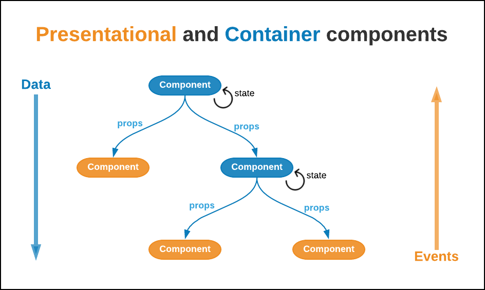
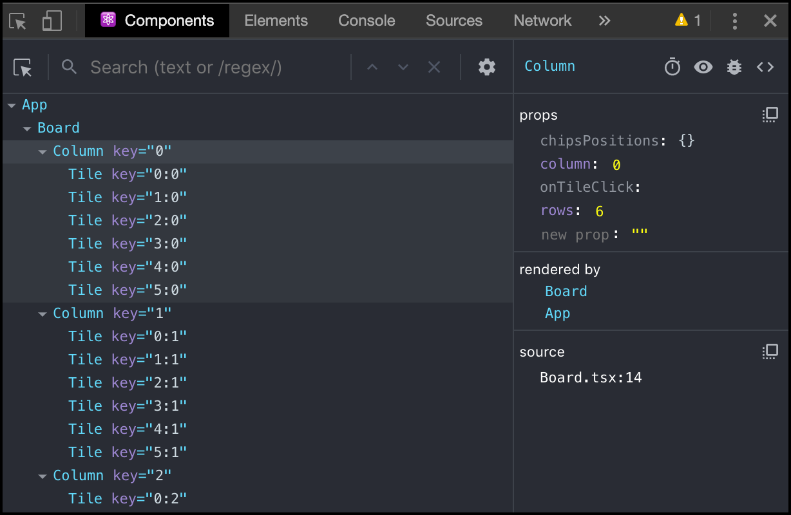

# Creating your first app with React and TypeScript

Now that we have covered the basics, it's time to make things real. In this exercise, we will set up an application from scratch, and then we will write some code to implement a game from scratch, [Connect Four](https://en.wikipedia.org/wiki/Connect_Four), by following a step-by-step walkthrough that will also help us to learn while we code. For this, we will create a real-life application.


By following this step-by-step walkthrough, you will learn while you code a real-life application. Are you ready? 👾

### Initial setup

> **Note:** If you want to start right away with the game logic, you can skip the steps 1-5 and use the application located in the **begin** folder of this Exercise. Remember to use `npm install` before running it.

[As we explained in the previous exercise](../exercise-1/README.md), neither TypeScript nor JSX runs in browsers. And since we are going to write code in these languages, we need to _transpile_ it before executing our application. To do this, we have two options:

- Discover, analyze and configure multiple tools ourselves (Webpack/Rollup, Babel/tsconfig, CSS Modules, etc.)
- Or take advantage of "scaffolders" (also named integrated toolchains), which are baked-apps that are already preconfigured and don't require any extra setup to get started, letting us to **only focus on our code**.

In this Exercise, we are going to go with the latter option, leveraging [Create React app](https://github.com/facebook/create-react-app), which is the de-facto tool to build React applications nowadays. And it's super easy to set up:

1. In your terminal, run `npx create-react-app connect-four --typescript`. This command will create a TypeScript application inside the folder **connect-four**. Wait for the process to complete. You should see a message similar to this:

   

   > **Note:** If `npx` doesn't work, try with `npm i -g create-react-app` and then `create-react-app connect-four --typescript`.

1. Browse to the **connect-four** folder you've just created and take a minute or two to analyze the folder structure. You are looking at a fully-functional application with the business logic inside the **src** folder:

   ```
   connect-four
   ├── node_modules
   │   ├── ...
   ├── public
   │   ├── favicon.ico
   │   ├── index.html
   │   └── manifest.json
   │   └── ...
   ├── src
   │   ├── App.css
   │   ├── App.test.tsx
   │   ├── App.tsx
   │   ├── index.css
   │   ├── index.tsx
   │   ├── logo.svg
   │   └── react-app-env.d.ts
   │   └── serviceWorker.ts
   ├── .gitignore
   ├── package-lock.json
   ├── package.json
   ├── README.md
   ├── tsconfig.json
   └── ...
   ```

1. Now, run `npm start`. This command runs the app in _"development mode"_, which provides a lot of perks like automatic reloading when you make changes to the code (a.k.a. [Hot Module replacement](https://webpack.js.org/concepts/hot-module-replacement/)).

   Open http://localhost:3000 to view the application in the browser.

   

   **Congratulations!** You've created your first application with React and TypeScript 👏 💃 🕺 👏

1. Let's take it for a spin. Open the app with VSCode or the IDE of your preference and navigate to the **src/App.tsx** folder.

   

   > **Note:** _Pro tip!_ You can open VSCode pointing to the folder your terminal is by running `code .`. Similarly, you could do the same for Atom with `atom .`. And for Sublime, you can run `subl .`.

1. Take a couple of minutes to analyze the code in this file:

   - At the top, you have some `import` statements. This is the way JavaScript (ES6) imports modules to a file. The value imported is stored in a variable for later use. _You can learn more about ES6 imports [here](https://developer.mozilla.org/en-US/docs/Web/JavaScript/Reference/Statements/import)._
   - _Line 5_ defines a React Function component named `App`. It returns JSX code that will be later rendered by the browser (after the transpilation). _React components help us to split our code into small pieces, following the single responsibility principle (or [SRP](https://en.wikipedia.org/wiki/Single_responsibility_principle))._
   - Between _lines 7 and 22_ there is JSX code that represents what we see rendered in the browser. Notice that it is almost identical to HTML, except _line 9_ that sets up the _src_ prop using a JavaScript variable reference (``).
   - Last, _line 26_ _exports_ our `<App />` function and makes it available to be _imported_ in other files.

1. With the app running locally (if you have stopped it, run `npm start` in your terminal), modify the code by removing the `</div>` closing tag in line 22, and save your changes.

   - Note that the IDE now displays an error:

     

   - And the browser displays a compilation error:

     

1. Fix the error by undoing what you did (we removed the `</div>` closing tag), save your changes and wait for the browser to refresh your app.
1. Now, open the **src/index.tsx** file. This is the main entry point of the application:

   ```js
   import React from "react";
   import ReactDOM from "react-dom";
   import App from "./App";

   ReactDOM.render(<App />, document.getElementById("root"));
   ```

   The most important things you need to learn now are:

   - This file _imports_ the `<App />` component, along with the React and ReactDOM libraries.
   - It executes the `ReactDOM.render()` method, passing the `<App />`component and a reference to the "root" `<div>` element.
   - You can find the HTML your browser renders when your app starts in the **public/index.html** file. In _line 31_, there is an empty `<div id="root">` element. This is where your app will be "mounted", which means that that your application's code will be injected into this HTML element.

This file has exactly the same content as the previous basic examples we saw in the previous post. **This is the power of React**: regardless of the complexity in your app, the code to render it is the same.

#### Wrapping up

In this quick walkthrough, we did the following:

1. We created a fully-functional web app with a single (npm) command in the Terminal.
1. We executed the web application locally and displayed it in the browser.
1. We analyzed the _React + TypeScript_ code of the app, both the main component and the main entry code. And then, we reviewed the main HTML code.

Last, don't forget that **browsers only understand HTML, JS, and CSS**, not TS or JSX. This _scaffolded_ app has a build process that will generate JS and CSS files and will place it inside of a _dist_ folder. All of these generated files will be referenced in the index.html file and sent to the browser to parse, read, interpret and execute.

### Adding the game logic to the app

Now that we understand the foundations of a React app, it's time to add the game logic. As we explained in the [previous exercise](../exercise/1), React applications split their business logic into different components. But there are different responsibilities we'll have to handle: the logic that decides who won (and if someone won), the logic that selects the elements to draw (and how), the one that determines whose player has the turn to make a move, etc. _How can we split up these responsibilities in a consistent and repeatable way?_

We'll use a widely-known pattern named **Presentational and Container components** to organize our components in a simple, but yet powerful structure:



This technique proposes to encapsulate all the business logic and state in parent components (_Container_, or _Smart_). And use their children components, usually the leaves, for rendering the UI and managing the user interaction (_Presentational_ or _Dumb_ components).

_Container_ components send both data and functions to their children via props. _Presentational_ components use the data to decide what and how to draw. And execute the functions when the user interacts with them, usually sending information as parameters.

> **Note:** since your app's will end up cascading the information from top to bottom, this approach is best suited for small/middle-sized apps. Large applications composed of a deeply nested hierarchy require different treatments that we will see in the next Exercise.

By following this idea, we can define the following entities for our app:

- An **App** component, in charge of storing the state of the application and calculating who is the winner. It is the main parent that oversees it all (the _Container_ component).
- A **Board** component, responsible for drawing the elements of the game (the _Presentational_ component). The board is composed of multiple **Columns**, which are composed of different **Tiles**, that might or might not have a chip. When a column is clicked, a new chip is added into an empty tile at the bottom.


> **Note:** Of course, this structure can vary depending on your preference. For instance, you can get rid of the **App** component and move its logic to the **Board** component. Or split the logic of the **Tiles** component in two, implementing a **Chip** component as well. _Can you think of other ways to organize your code?_.

#### Creating a Tile component

1. Create a new folder named **components** inside the **src** folder.
1. Create a folder named **Tile** and inside the following (and for now empty) files:

   - A **Tile.module.css** file to store the CSS code.
   - A **Tile.tsx** file for the React's component logic.
   - And a **types.ts** file for the TypeScript types of the component.

1. Open up the **src/components/Tile/types.ts** file and paste the following code:

   ```ts
   export interface Props {
     id: string;
     chipType?: string;
     onClick: (id: string) => any;
   }
   ```

   By typing the **Tile** component's **props**, we define its interface, or contract. It tells the component consumer that:

   1. It has to provide an `id` through the component's props.
   1. It could send a `chipType` to the component. As we mentioned above, **Tiles** can have a **Chip** or not.
   1. It has to attach a function to the `onClick` prop, that will be triggered when the user clicks on a **Tile**.

1. Then, open the **src/components/Tile.tsx** file and paste the following code:

   ```js
   import React from "react";
   import classNames from "classnames";
   import styles from "./Tile.module.css";
   import { Props } from "./types";

   export default class Tile extends React.PureComponent<Props> {
     render() {
       const { id, chipType, onClick = () => {} } = this.props;
       const chipCssClass = classNames(
         styles.chip,
         chipType === "red" ? styles.red : styles.yellow
       );

       return (
         <div className={styles.tile} onClick={() => onClick(id)}>
           {chipType && <div className={chipCssClass} />}
         </div>
       );
     }
   }
   ```

   By looking at this code you'll notice that the **Tile** component is a _presentational_ component in charge of drawing tiles on your board. It decides if a chip is present by checking the value of the `chipType` prop, and it sets the CSS class based on its value. Last, when clicked, it triggers the function set to the `onClick` prop, sending the **Tile**'s `id` as parameter.

   > **Note:** Have you noticed that we attached the **Props** interface to the `React.PureComponent` definition? This is how you type React class. The IDE will understand this and will tell you the shape of the components properties if you hover your mouse over `this.props` value in the first line of the `render()` method. _Give it a try!_

1. Last, open the **src/components/Tile.module.css** file and paste this CSS code:

   ```css
   .tile {
     width: 75px;
     height: 75px;
     border: solid 10px #3355ff;
     border-radius: 100%;
     background-color: white;
   }

   .chip {
     width: 75px;
     height: 75px;
     border-radius: 100%;
     background-color: gray;
   }

   .yellow {
     background-color: #ffff33;
   }

   .red {
     background-color: #ff010b;
   }
   ```

   > **Note:** Create React app treats CSS files using `[name].module.css` differently from a regular CSS file, by transpiling them using the [CSS Modules](https://github.com/css-modules/css-modules) library. The main benefit of this is that you don't need to worry about CSS class name clashing, as each file can be treated as an isolated module. This can be achieved because, when transpiling files, all CSS class names are replaced with a "unique" value of the format `[filename]_[classname]__[hash]`.
   >
   > For more information about this library, click [here](https://create-react-app.dev/docs/adding-a-css-modules-stylesheet).

#### Creating a Column component

1. Now navigate to the **components** folder and create a new folder inside named **Column**.
1. Inside this folder, create the following files: a **Column.module.css** file to store the CSS code, a **Column.tsx** file for the React's component logic and a **types.ts** file for the TypeScript types of the component.
1. Open up the **src/components/Column/types.ts** file and paste the following code that defines the props (contract) of the **Column** component:

   ```js
   import { ChipsPositions } from "../App/types";

   export interface Props {
     column: number;
     rows: number;
     chipsPositions: ChipsPositions;
     onTileClick: (id: string) => any;
   }
   ```

   This code tells the component's consumer:

   - It needs to provide a `column` number. This value acts as the ID of the element.
   - It needs to define how many `rows` the **Column** component will have.
   - The `chipsPositions` prop is an object that knows the position of each chip. We will see how this object is built later. For now, you only need to know that it can tell us if there is a chip inside of a **Tile** or not.
   - Last, the `onTileClick` function is used to let the parent know when the user clicks on a specific tile.

1. Then, open the **src/components/Column.tsx** file and paste the following code:

   ```js
   import React from "react";
   import Tile from "../Tile/Tile";

   import styles from "./Column.module.css";
   import { Props } from "./types";

   export default class Column extends React.PureComponent<Props> {
     render() {
       const { column, rows, chipsPositions, onTileClick } = this.props;
       const tiles = [];

       for (let row = 0; row < rows; row++) {
         const tileId = `${row}:${column}`;
         const chipType = chipsPositions[tileId];
         tiles.push(
           <Tile
             key={tileId}
             id={tileId}
             chipType={chipType}
             onClick={onTileClick}
           />
         );
       }

       return <div className={styles.column}>{tiles}</div>;
     }
   }
   ```

   This (also _presentational_) code renders a `<div>` element containing as many **Tile** components as the `rows` value indicates (sent via _props_). Each tile will receive a `chipType` and the `onTileClick()` function. Notice that the unique `tileId` is defined here by combining the values of `row` and `column`.

1. Last, open the **src/components/Column/Column.module.css** file and paste the following CSS code:

   ```css
   .column {
     display: flex;
     flex-direction: column;
     cursor: pointer;
   }
   ```

#### Creating a Board component

1. Similarly, navigate to the **components** folder and create a new folder inside named **Board**.
1. Inside this folder, create the following files: a **Board.module.css** file to store the CSS code, a **Board.tsx** file for the React's component logic and a **types.ts** file for the TypeScript types of the component.
1. Open up the **src/components/Board/types.ts** file and paste the following code that defines the props (contract) of the **Board** component:

   ```js
   import { ChipsPositions } from "../App/types";

   export interface Props {
     columns: number;
     rows: number;
     chipsPositions: ChipsPositions;
     onTileClick: (id: string) => any;
   }
   ```

   This code tells the component's consumer that:

   - It has to provide the number of `columns` and `rows` the board will have.
   - It has to send the `chipsPositions` object. This information is used by the **Column** component, not the **Board**.
   - It has to provide an `onTileClick` function, that will be used by the **Tile** component to signal when it is clicked.

1. Then, open the **src/components/Board.tsx** file and paste the following presentational code:

   ```js
   import React from "react";
   import Column from "../Column/Column";

   import styles from "./Board.module.css";
   import { Props } from "./types";

   export default class Board extends React.PureComponent<Props> {
     renderColumns() {
       const { columns, rows, chipsPositions, onTileClick } = this.props;

       const columnsComponents = [];

       for (let column = 0; column < columns; column++) {
         columnsComponents.push(
           <Column
             key={column}
             column={column}
             rows={rows}
             chipsPositions={chipsPositions}
             onTileClick={onTileClick}
           />
         );
       }

       return <>{columnsComponents}</>;
     }

     render() {
       return <div className={styles.board}>{this.renderColumns()}</div>;
     }
   }
   ```

   This code is similar to the Column component, but instead of creating Tiles, we create multiple columns, passing the required information to them, and then we render the result. The `this.renderColumns()` method encapsulates this logic.

   > **Note:** Have you noticed that we also use _React.Fragment_? Probably not because we are using the shorthand `<></>`, which is an equivalent of `<React.Fragment></React.Fragment>`.

1. Last, open the **src/components/Board/Board.module.css** file and paste the following CSS code:

   ```css
   .board {
     display: flex;
     flex-direction: row;
     border: solid 5px #002bff;
     border-radius: 5px;
     background-color: #3355ff;
   }

   .columns {
     display: flex;
     flex-direction: row;
   }
   ```

_We are almost there! 🙌_

#### Creating the App component

We are now going to develop the main logic for our game. Pay special attention to this section:

1. Create a folder named **App** inside the **src/components** folder.
1. Inside this folder, create the **App.module.css** file, the **App.tsx** file and the **types.ts** file.
1. Open up the **src/components/App/types.ts** file and paste the following types:

   ```js
   export interface ChipsPositions {
     [key: string]: Player;
   }

   export type Player = "red" | "yellow" | "";

   export interface Props {
     columns: number;
     rows: number;
   }

   export interface State {
     chipsPositions: ChipsPositions;
     gameStatus: string;
     playerTurn: Player;
   }
   ```

   We define important things here:

   - The shape of the `ChipsPositions` object: a dictionary containing in each position one of these values of `Player` type: `"red"`, `"yellow"` or `""` (representing an empty value).
   - We define the shape of the App's `Props` and `State`. The former tells us that we need to provide the number of `columns` and `rows` for the **App** component to initialize, while the latter tells us all the information that will be stored by the component.

1. Now, open the **src/components/App/App.tsx** and paste the following code:

   ```js
   import React from "react";
   import Board from "../Board/Board";

   import { Props, State, ChipsPositions } from "./types";
   import styles from "./App.module.css";

   export default class App extends React.PureComponent<Props, State> {
     state: State = {
       chipsPositions: {},
       playerTurn: "red",
       gameStatus: "It's red's turn"
     };

     calculateGameStatus = (
       playerTurn: string,
       chipsPositions: ChipsPositions
     ): string => {
       // TODO
     };

     handleTileClick = (tileId: string) => {
       // TODO
     };

     renderBoard() {
       const { columns, rows } = this.props;
       const { chipsPositions } = this.state;
       return (
         <Board
           columns={columns}
           rows={rows}
           chipsPositions={chipsPositions}
           onTileClick={this.handleTileClick}
         />
       );
     }

     renderStatusMessage() {
       const { gameStatus } = this.state;
       return <div className={styles.statusMessage}>{gameStatus}</div>;
     }

     render() {
       return (
         <div className={styles.app}>
           {this.renderBoard()}
           {this.renderStatusMessage()}
         </div>
       );
     }
   }
   ```

   This is the basic structure of the component: presentational logic to draw/render the **Board** and the **Status** message, and a default **App**'s state. This code is completely functional, but the app still won't react if the user interacts with the board. _We'll implement this logic in the next few lines._

1. Implement the `handleTileClick()` method to react when the user clicks on a Tile.

   ```js
   handleTileClick = (tileId: string) => {
     const { chipsPositions, playerTurn } = this.state;

     // Get the last empty tile of the column
     const column = parseInt(tileId.split(":")[1]);
     let lastEmptyTileId = this.getLastEmptyTile(column);

     // If there is no empty tile in the column, do nothing
     if (!lastEmptyTileId) {
       return;
     }

     // Add chip to empty tile
     const newChipsPositions = {
       ...chipsPositions,
       [lastEmptyTileId]: playerTurn
     };

     // Change player turn
     const newPlayerTurn = playerTurn === "red" ? "yellow" : "red";

     // Calculate game status
     const gameStatus = this.calculateGameStatus(newPlayerTurn, newChipsPositions);

     // Save new state
     this.setState({ chipsPositions: newChipsPositions, playerTurn: newPlayerTurn, gameStatus });
   };

   getLastEmptyTile(column: number) {
     const { rows } = this.props;
     const { chipsPositions } = this.state;

     for (let row = rows - 1; row >= 0; row--) {
       const tileId = `${row}:${column}`;
       if (!chipsPositions[tileId]) {
         return tileId;
       }
     }
   }
   ```

   Take a couple of minutes to understand what we are doing here:

   - First, we need to get the last empty **Tile** of the column that was clicked. We obtain the column number by parsing the `tileId`.
   - Then, we add a chip to the selected tile depending on the player's turn, known by the **App** component alone. And we recalculate the game status.
   - Last, we store all the new information in the component's state, re-rendering the entire application if something changes (React will decide this for us).

1. Last, implement the `calculateGameStatus()` method by pasting the following code inside the **App** component. The code contains the logic that decides who the winner is, or who plays next:

   ```js
   calculateGameStatus = (
     playerTurn: string,
     chipsPositions: ChipsPositions
   ): string => {
     const { columns, rows } = this.props;

     // Check four in a row horizontally
     for (let row = 0; row < rows; row++) {
       let repetitionCountStatus = { playerChip: "", count: 0 };

       for (let column = 0; column < columns; column++) {
         const chip = chipsPositions[`${row}:${column}`];

         // If there is a chip in that position, and belongs to a player,
         // count that chip for that player (either increase the count or start over)
         if (chip && chip === repetitionCountStatus.playerChip) {
           repetitionCountStatus.count++;
         } else {
           repetitionCountStatus = { playerChip: chip, count: 1 };
         }

         // If the count for a player is 4, that player won
         if (repetitionCountStatus.count === 4) {
           return `Player ${repetitionCountStatus.playerChip} won!`;
         }
       }
     }

     // Check four in a row vertically
     for (let column = 0; column < columns; column++) {
       let repetitionCountStatus = { playerChip: "", count: 0 };

       for (let row = 0; row < rows; row++) {
         const chip = chipsPositions[`${row}:${column}`];

         // If there is a chip in that position, and belongs to a player,
         // count that chip for that player (either increase the count or start over)
         if (chip && chip === repetitionCountStatus.playerChip) {
           repetitionCountStatus.count++;
         } else {
           repetitionCountStatus = { playerChip: chip, count: 1 };
         }

         // If the count for a player is 4, that player won
         if (repetitionCountStatus.count === 4) {
           return `Player ${repetitionCountStatus.playerChip} won!`;
         }
       }
     }

     // TODO: Check four in a row diagonally

     return `It's ${playerTurn}'s turn`;
   };
   ```

   > **Note:** Did you notice that this code does not check for four consecutive chips of the same value in diagonal? _Can you come up with an implementation for this?_ If you do, send it to me [as a Pull Request!](https://help.github.com/en/articles/creating-a-pull-request).

#### Initializing the app

1. Open up the **src/index.tsx** file and replace its content with the following code:

   ```js
   import React from "react";
   import ReactDOM from "react-dom";
   import App from "./components/App";
   import "./index.css";

   // Initialize the app with 7 columns and 6 rows
   ReactDOM.render(
     <App columns={7} rows={6} />,
     document.getElementById("root")
   );
   ```

1. Start the app by running `npm start` in a terminal.
1. In the newly opened browser window, open the **Developer Console**, and then click the **Components** tab. You will see the hierarchy tree of the React application, composed of the components you've just created:

   

1. Play with the game a little bit and then check the different **Tile**s of the board. Notice that the properties received will change when you interact with them.


> **Note:** You can also change a prop directly by modifying its value in the right panel. Try it yourself by turning a **Tile**'s chip type from `"red"` or `undefined` to `"yellow"`.

Congratulations! You have created your first game with React and TypeScript

🎉🎉

### Wrapping up

In this exercise, we learned the following:

- How to create an application from scratch using React and TypeScript.
- How to split your app's business logic into small components.
- How to send information and notify user events via props.
- How to use the React Developer tools to visualize your application's component tree and its state.
