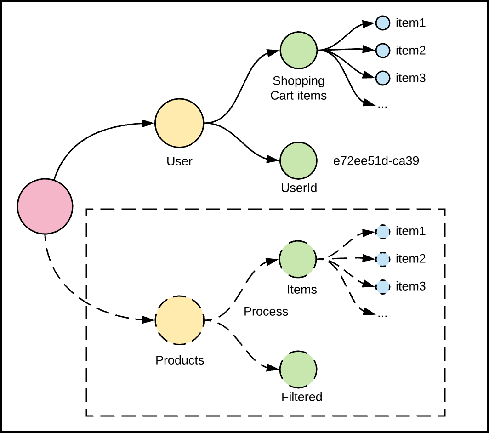
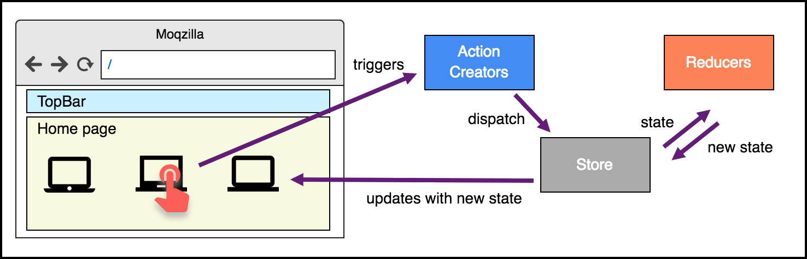
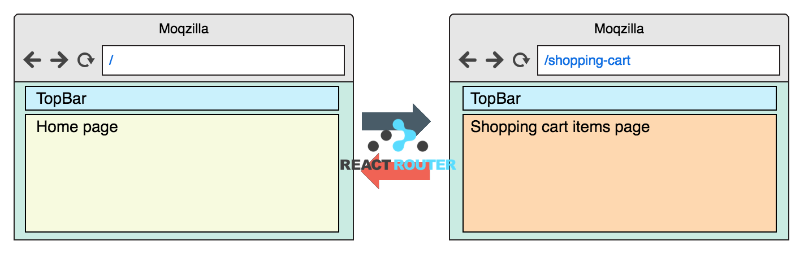

# Navigation

In this exercise, we will add new functionality that all real-world applications have, navigation, and we'll see how easy is to integrate this feature with the state management system. We'll also add a new state node into our app and we'll learn how to interact with the Redux nodes in different pages.

We'll end up with a fully-functional application powered with Redux and React Router.

## Section 1: Add a new state node for Products

1. Open the terminal and navigate to the **exercise-3/begin/shopping-app** folder.
1. In this folder, run `npm i` to install all the dependencies of the application.
1. Run the app using `npm start` to see something like this.

    

Although it looks like an empty app, remember that we've already implemented:

* A Redux store to manage the state of the application.
* A **User** data domain to store user information, like the user shopping cart.
* An `<App />` container component that connects the Redux store with the rest of the components.
* A `<ShoppingCart />` and a `<Topbar />` component.

Just as a quick recap, this is what we implemented in the previous exercise:


### Adding a new state node to store Products

We are now going to improve our current app's state by adding a new node to store product items. This will let us store information to select items from the initial page of our app (the typical Home page) to the user's shopping cart. In terms of the Redux state tree, this is what we are going to do:



1. Create a new folder named **products** under the **src/domains** folder. We are going to create the _actions_ and _reducers_ of this state's node.
1. **Implement the Products actions:** In the _products_ folder, create a new file named **actions.ts** and paste the following code:

    ```js
    import { createAction } from 'redux-actions';
    import productsService from '../../services/products-service';

    const FETCH_PRODUCTS = 'FETCH_PRODUCTS';

    export default {
      FETCH_PRODUCTS,
      fetchProducts: createAction(FETCH_PRODUCTS, productsService.getAll),
    };
    ```

    > **Note:** What are we doing? We are defining a new action creator named `fetchProducts()` that will return actions of type `FETCH_PRODUCTS`. These actions will execute the `productsService.getAll()` method and will return its result as the payload of a new object, following the [Flux Standard Action](https://github.com/redux-utilities/flux-standard-action) standard.

    If you want to know more about _action creators_, see [here](https://redux.js.org/basics/actions#action-creators).

1. **Implement the Products reducer:**  In the same _products_ folder, create a new file named **reducers.ts** and fill it with the following code. Notice that we are just adding the structure of the reducer, we haven't implemented the core code yet.

    ```js
    import { handleActions } from 'redux-actions';

    const initialState = {
      items: undefined,
    };

    export default handleActions({

      // TODO: add reducers (action handlers)

    }, initialState);
    ```

    > **What does this code do?** This code uses the utility function [handleActions](https://github.com/redux-utilities/redux-actions) to set up the action handlers of this reducer with ease. It expects two arguments: an object whose keys are action types and values are the handlers (a function) and the initial state of the reducer's node as the second argument.

    If you want to know more about _reducers_ and how to handle actions, see [here](https://redux.js.org/basics/reducers).

1. The next step is to identify the actions we want this reducer to handle and implement the function in charge of this. We already know that we need to update the state when we fetch new products from the server, let's implement the function for this. Paste the following code inside the `handleActions()` first argument (the object)

    ```js
    export default handleActions({

      [actions.FETCH_PRODUCTS]: (state: any, action: any) => {
        const products = action.payload;
        return {
          ...state,
          items: products,
        };
      },

    }, initialState);
    ```

1. Additionally, we want to increase/decrease the number of products we show when users remove/add items from their shopping cart (we don't want to show them twice). For this, we've already implemented the action types `ADD_SHOPPING_CART_ITEM` and `REMOVE_SHOPPING_CART_ITEM`, located in the **src/domains/user/actions.ts** file. For this, first we need to import these action types from this file by adding the following line at the top of the file:

    ```js
    import userActions from '../user/actions';
    ```

1. With this `import` in place, we can now reference _"external"_ actions and implement action handlers for them.

    ```js
    export default handleActions({

      ...

      [userActions.ADD_SHOPPING_CART_ITEM]: (state: any, action: any) => {
        const productInCart = action.payload;
        const filteredItems = state.items.filter((item: any) => item.id !== productInCart.id);

        return {
          ...state,
          items: filteredItems,
        };
      },

      [userActions.REMOVE_SHOPPING_CART_ITEM]: (state: any, action: any) => {
        const itemToAdd  = action.payload;

        return {
          ...state,
          items: [].concat(...state.items, itemToAdd)
        };
      },

    }, initialState);
    ```

    > **Note:** Remember: reducers are tied to a state node. What we are simply doing here is to react when an action is triggered and update the state because of it. In this case, we are either adding or removing items from the _product's list_. On the other hand, actions are not particularly tied to a state node, but they are usually grouped with a reducer because these two _"come in pairs"_. But this doesn't mean that we could reference these actions in another state node, as we did.

1. Finally, and just like we did in Exercise 2, we are going to merge the actions of reducers we created with our data domain object. For this, open the **src/domains/index.ts** file and add a reference to the files we've just created.

    ```js
    import productsActions from './products/actions';
    import productsReducers from './products/reducers';
    ```

1. Then, merge these values with the `actions` and `reducers` objects:

    ```js
    const actions = {
      ...productsActions,
      ...userActions,
    };

    const reducers = {
      products: productsReducers,
      user: userReducers,
    };
    ```

    > **Note:** notice that we are creating a new **products** node in the reducer. These are our application state nodes, where our application state will be stored.

With this in place, we are now ready to display these products on the Home page.

## Section 2: Adding a Home page



1. Navigate to the **Home** folder under **src/components**. As our first step, create the **types.ts** file and define the contract of the component we are about to create:

    ```js
    import { IProduct } from '../App/types';

    export interface IProps {
      products: IProduct[];
      fetchProducts: (filter?: string) => void;
      addProductToCart: (item: IProduct) => any;
    }
    ```

    This component will:
    * Display all the `products` received via props.
    * If the `products` prop is not defined, trigger the `fetchProducts()` action to retrieve new products from the backend. This will, in time, re-render the component, now filled with products.
    * Allow users to add products to their shopping cart, by triggering the `addProductToCart()` action.

1. Now, create a **Home.tsx** file in this folder and start implementing it by adding this initial code:

    ```js
    import * as React from 'react';
    import './styles.css';
    import { IProps } from './types';

    class Home extends React.PureComponent<IProps> {
      public render() {
        return (
          <div className="home">
            { this.renderProducts() }
          </div>
        );
      }
    }

    export default Home;
    ```

1. The next step is to implement the logic to render all products received via `props`. For this, add the `renderProducts()` method with this code:

    ```js
    class Home extends React.PureComponent<IProps> {

      public renderProducts() {
        const { products } = this.props;

        if (!products || !products.length) {
          return <p className="home-empty">No products</p>;
        }

        return products.map(item => (
          <a href="" key={item.id} className="product-item" data-id={item.id} onClick={this.handleItemClick}>
            
            <span className="product-item-name">{item.name}</span>
            <span className="product-item-price">{item.price}</span>
          </a>
        ));
      }

      ...
    }
    ```

    > **Note:** this code displays all the products as clickable elements, or an empty message if there are no products.

1. Now, we need to handle the logic to add products to the Shopping cart. For this, implement the `handleItemClick()` method using the following code:

    ```js
      public handleItemClick = (evt: any) => {
        const { products, addProductToCart } = this.props;
        evt.preventDefault();

        const productToAdd = products.find(item => item.id === evt.currentTarget.dataset.id);
        if (productToAdd) {
          addProductToCart(productToAdd);
        }
      }
    ```

    > **Note:** notice that this code will call the `addProductToCart()` function with a product. This information will be sent to the Redux store to orchestrate the proper logic in our app. Take a moment to analyze what will happen:

    1. The `addProductToCart()` function will be fired, dispatching a new action.
    1. An action handler listening to this action will be executed, returning a new state that will replace the current one.
    1. The component will be rendered again with the updated information.

1. The last thing we need to add is the ability to execute a fetch of products when this page starts. For this, we'll take advantage of React's `componentDidMount()` method by adding it to our class with the following code:

    ```js
    class Home extends React.PureComponent<IProps> {

      public componentDidMount() {
        const { products, fetchProducts } = this.props;

        if (!products) {
          fetchProducts();
        }
      }

      ...
    }
    ```

    > **Note**: The benefit of using `componentDidMount()` is that we are guaranteeing that this action will be executed only once and immediately after a component is mounted (inserted into the DOM tree). Future renders won't trigger this action.

    If you want to know more about React's lifecycle, see [this diagram](http://projects.wojtekmaj.pl/react-lifecycle-methods-diagram/).

1. The next step is to create the _container component_, in charge of connecting the React component with Redux. For this, let's start with the creation of the **Home.container.ts** file.

1. Paste the following code with the proper `import` statements. Notice that we are referencing the `<Home />` component we've created in the previous steps.

    ```js
    import { connect } from 'react-redux';
    import { actions } from '../../domains';
    import { IProduct } from '../App/types';
    import Home from './Home';
    ```

1. As we learned before, we need to add the logic to map the _React's state_ and the _actions_ into `props`. To do this, add these functions inside the file, right below the code you added in the previous step.

    ```js
    const mapStateToProps = (state: any) => ({
      products: state.products.items,
    });

    const mapDispatchToProps = (dispatch: any) => ({
      fetchProducts: () => dispatch(actions.fetchProducts()),
      addProductToCart: (item: IProduct) => dispatch(actions.addShoppingCartItem(item))
    });
    ```

    > **Note:** What are we doing here? This is pure ES6 code, the latest version of JavaScript. We are simply creating two functions that will receive some information as arguments and return an object as response. For instance, the first function is equivalent to this JS code, that.

        ```js
        var mapStateToProps = function (state) {
          return {
            products: state.products.items
          };
        };
        ```

    The code above is fully-compatible with ES5, the 5th edition of the JavaScript standardized in 2009.

1. Add a line at the end of the file to export the result of the `connect()` function by adding this:

    ```js
    export default connect(mapStateToProps, mapDispatchToProps)(Home);
    ```

    > **Note:** This is the code that takes care of mapping the information stored in Redux with your component, passing everything as props.

    If you want to know more about the `connect()` function and what it does, see [here](https://github.com/reduxjs/react-redux/blob/master/docs/api.md#connectmapstatetoprops-mapdispatchtoprops-mergeprops-options).

1. The last thing you need to do is to create the **src/components/Home/index.ts** file and use it to export the container component you've just designed. This file will simplify the use of this file from upper folders.

    ```js
    import HomeContainer from './Home.container';
    export default HomeContainer;
    ```

We have now all the pieces connected and ready to be used. But we only have a single entry point. The question that arises is, how can we let users see the _Home_ page and the _Shopping Cart_ page in our app? The answer is simple, **we need to implement navigation**.

## Section 3: Create a navigation/routing mechanism in our app

Navigation is a standard feature that all applications have. The usual approach to enable this is to configure a service that maps a particular page with a specific URL, a mechanism known as _routing_.

There are several approaches out there, but the most widely used in React is [React Router](https://github.com/ReactTraining/react-router). It's current version, v4, proposes a modern way to manage this. Leveraging the _everything is a component_ logic that React proposes, it suggests the creation of components (`<Router />`, `<Route />`, `<Switch />`, `<Link />`, etc.) to encapsulate specific pieces of this mechanism.



Let's see how this works by adding it into our app.

### Setting up React Router

1. Open a terminal in the root folder of the Shopping App application and install the required packages we are going to use by running `npm i -S react-router react-router-dom history connected-react-router`.

1. Since we are using TypeScript, we can get the definition of all functions and methods by also installing the types of these libraries. To enable this, run `npm i -D @types/react-router @types/react-router-dom @types/history`.

1. Now we will update the entry point of our app to start with React Router + Redux enabled. For this, open the **src/index.tsx** file and add the following statements:

    ```js
    import { createBrowserHistory } from 'history';
    import { connectRouter, routerMiddleware } from 'connected-react-router';
    import { ConnectedRouter } from 'connected-react-router';
    ```

1. Next, paste the following line below to instantiate a browser history object.

    ```js
    const history = createBrowserHistory();
    ```

    > **What is a browser history?** [history](https://www.npmjs.com/package/history) is an npm package that wraps the logic of the HTML5 History API and provides a clear, cross-browser contract that you can use in your app.

    If you want to know more about the HTML5 History API, see [here](https://developer.mozilla.org/en-US/docs/Web/API/History_API).

1. The next step is to connect Redux with the Router, by updating the `createStore()` call to look like the following:

    ```js
    const store = createStore(
      connectRouter(history)(combineReducers(reducers)),
      composeEnhancers(applyMiddleware(thunkPromiseMiddleware, routerMiddleware(history))),
    );
    ```

    > **Note:** Take a look at the `connectRouter()` line. This is the most important piece of information, as it takes care of adding a new `router` node in our state tree with the navigation information. This new node is later managed by `routerMiddleware()` we add two lines after.

    Although this is an optional step, it's essential for our use case as it simplifies our logic a lot. **Why?** Because with this in place we will be able to get information about the current URL from the store's state.

1. Finally, we will add a new component to our app that will take care of connecting the route's information into our app. It's important to add this component right below the Redux's `<Provider />`, like the code snippet below shows:

    ```js
    ReactDOM.render(
      <Provider store={store}>
        <ConnectedRouter history={history}>
          <App />
        </ConnectedRouter>
      </Provider>,
      document.getElementById('root') as HTMLElement
    );
    ```

With these simple steps, our app is now connected to the browser's navigation logic. In the next section, we will learn how to use this to display or hide components.

### Configuring our Router in our app

We are now going to update our _React Router/Redux_-powered application to support navigation. We will split these configurations into several features to show them in different sections.

> **Note:** If you want to learn more about React Router's logic and philosophy, see its [documentation](https://reacttraining.com/react-router/web/guides).

#### Getting routing information from the Redux store

Since we are now able to get the routing information directly from the Redux state, we can get rid of the code that reads the `window.location` object.

1. Open the **src/components/App/types.ts** and update the `IProps` interface to receive the `pathname` as a prop:

    ```js
    export interface IProps {
      pathname: string;
      shoppingCartItems: IProduct[];
    }
    ```

1. Next, open the **App.container.ts** file to map the Redux's state with the new `pathname` prop:

    ```js
    const mapStateToProps = (state: any) => ({
      pathname: state.router.location.pathname,
      ...
    });
    ```

    > **Note:** Notice that we are getting this information from the state's node `router`. This node is managed by React Router and we configured it when we added the `connectRouter(history)(combineReducers(reducers))` line in the **src/index.tsx** file.

1. Last, update the first line of the `getPages()` method and replace the use of `window.pathname` with a simple lookup in the `this.props` object.

    ```js
    class App extends React.Component<IProps, {}> {
      ...

      public getPages() {
        const { pathname } = this.props;
        ...
      }
    }
    ```

Notice that this sample application uses this information to create a breadcrumb, a component that will display the navigation users did in your app by just looking at the current URL.

#### Configuring the main Navigation of your app

React Router proposes that you define the Routes in the rendering phase, deciding what components to display based on the URL. This unique mechanism lets you do several things with relatively small portions of code, like configuring nested routes, responsive routes, dynamic redirects, etc.

1. In the **App.tsx** component, add the following `import` statements at the top of the file:

    ```js
    import { Route, Switch } from 'react-router';
    ```

    We are going to use two React components to create our routing mechanism:

    * The `<Route />` component is the one in charge of rendering another component (a UI, a page, etc.) when a location matches the route’s path. You can learn more about it [here](https://reacttraining.com/react-router/web/api/Route).
    * The `<Switch />` component is used to render the first `<Route>` or `<Redirect>` that matches the location, very useful when you want to render only one component of the list. You can learn more about it [here](https://reacttraining.com/react-router/web/api/Switch).

1. Now, update what the `render()` method returns with the following code:

    ```js
    public render() {
      const pages = this.getPages();
      const { shoppingCartItems = [] } = this.props;

      return (
        <div className="app">
        <TopBar pages={pages} itemsInCart={shoppingCartItems.length} />
        <Switch>
            <Route exact={true} path="/" component={Home} />
            <Route path="/shopping-cart" component={ShoppingCart} />
          </Switch>
        </div>
      );
    }
    ```

    > **Note:** What are we doing here? We are setting up the main route configuration of our app. In this case, we are saying that we will render the `<Home />` component if the URL is exactly `/` and the `<ShoppingCart />` component if the URL is `/shopping-cart`.

    This configuration can also be applied in other sub-components, splitting your routing mechanism into several pieces. It is indeed a powerful mechanism.

**But, how can we send data to the `<ShoppingCart />` component now?** Well.. we learned this, we can simply _connect_ this component and get the information directly from Redux. For this, follow these steps:

1. Create a **ShoppingCart.container.ts** file under the **src/components/ShoppingCart** folder and paste this code:

    ```js
    import { connect } from 'react-redux';
    import { actions } from '../../domains';
    import { IProduct } from '../App/types';
    import ShoppingCart from './ShoppingCart';

    const mapStateToProps = (state: any) => ({
      items: state.user.shoppingCartItems,
    });

    const mapDispatchToProps = (dispatch: any) => ({
      onItemRemove: (item: IProduct) => dispatch(actions.removeShoppingCartItem(item)),
    });

    export default connect(mapStateToProps, mapDispatchToProps)(ShoppingCart);
    ```

1. And update the **src/components/ShoppingCart/index.ts** to export this new container component:

    ```js
    import ShoppingCartContainer from './ShoppingCart.container';
    export default ShoppingCartContainer;
    ```

    > **Note:** If you didn't notice it before, take a look at how we are referencing the `<ShoppingCart />` component in the `<App />` component: we are only adding a path to the folder. And because by convention, the entry point of each folder is the _index_ file, this is only what we need to do.

#### Adding links to navigate between pages

You can also use React Router to add links to navigate between pages, without forcing a full page refresh (that will clean up your state).

1. Open the **src/components/TopBar/components/ShoppingCartStatus/index.tsx** file.
1. Add the following `import` statement at the top of the file to get the React Router's `<Link />` component:

    ```js
    import { Link } from 'react-router-dom';
    ```

1. Replace the `<a>` element with the `<Link />` component. Don't forget to replace the `href` attribute with a `to` attribute.

    ```js
    class ShoppingCartStatus extends React.PureComponent<IProps> {
      public render() {
        const { itemsInCart } = this.props;
        return (
          <Link className="shopping-cart-status" to="/shopping-cart">
            ...
          </Link>
        );
      }
    }
    ```

1. Open the **src/components/TopBar/components/Breacrumbs/index.tsx** file and replace the `<a>` component with the `<Link />`:

    ```js
    import * as React from 'react';
    import { Link } from 'react-router-dom';
    ...

    class Breadcrumbs extends React.PureComponent<IProps> {
      public renderPageLinks() {
        ...
        return pages.map((item, index) => (
          <React.Fragment key={item.url}>
            <Link className="breadcrumbs-link" to={item.url}>{ item.name }</Link>
            ...
    ```

#### Testing the app!

If you followed the steps to the letter, by following these steps you should see something like the image below:

1. To test the app run `npm start` in the root folder of the project.
1. Click the different products that are shown to add them to the shopping cart.
1. Then, click the icon at the top right to see the status of the current cart.
1. Last, click the breadcrumbs to navigate to the previous page, or click the browser's back button.


### Wrapping up

In this section, we learned the following:

* How to create new state nodes to store new data.
* How to react to actions triggered to update these nodes from different reducers.
* How to set up React Router in an application.
* How to configure the routing mechanism in an app and add links to navigate between pages.

## Checkpoint

In this section, we will review the concepts we learned so far, just in case there is something we need to analyze. Just to shake things up, we are going to use the real code, instead of the libraries we were using before.

### React components

* What is a functional component?

    ```js
    function Welcome(props) {
      return <h1>Hello, {props.name}</h1>;
    }
    ```

* What is a class component?

    ```js
    class Welcome extends React.PureComponent {
      render() {
        return <h1>Hello, {this.props.name}</h1>;
      }
    }
    ```

### Props and state

* What are props? How can you use them?

    ```js
    <Welcome name="Nano" />
    ```

* What is state? How can you update your component when it changes?

    ```js
    class ShoppingCart extends React.PureComponent {
      constructor(props) {
        super(props);
        this.state = { items: [] };
      }

      componentDidMount() {
        const { fetchUsername } = this.props;
        fetchShoppingCartItems()
          .then(items => this.setState({ items }));
      }

      render() {
        const { items } = this.state;
        return <p>You have {items.length} in your cart</p>;
      }
    }
    ```

### Redux

* What is an action creator? What does it return?

    ```js
    const ADD_PRODUCT = 'ADD_PRODUCT';

    export function addProduct(product) {
      return { type: ADD_PRODUCT, product };
    }
    ```

* What is a reducer? What is its responsibility?

    ```js
    const initialState = { products: [] };
    export function productReducer(state = initialState, action) {
      switch (action.type) {
        case ADD_PRODUCT:
          const newProduct = action.payload;
          return [].concat(state.products, newProduct);
        default:
          return state;
      }
    }
    ```

* How you can connect the actions and reducers with a component?

    ```js
    const mapStateToProps = (state) => ({
      products: state.products,
    });

    const mapDispatchToProps = (dispatch) => ({
      addProduct: (product) => dispatch(actions.addProduct(product)),
    });
    ```

### React Router

* How can you split your app into different pages? What are we doing here?

    ```js
    export default  () => (
      <Router>
        <div>
          <ul>
            <li><Link to="/">Home</Link></li>
            <li><Link to="/about">About</Link></li>
            <li><Link to="/topics">Topics</Link></li>
          </ul>
          <Route exact path="/" component={Home}/>
          <Route path="/about" component={About}/>
          <Route path="/topics" component={Topics}/>
        </div>
      </Router>
    );
    ```

🎉🎉🎉

