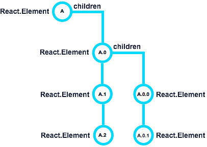
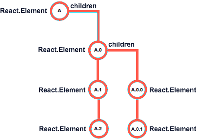
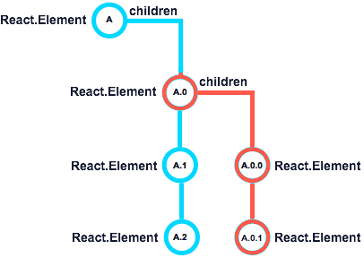

# Managing your application state with Redux

In this exercise, we will review what we did in the previous Exercise and we'll analyze together the technical debt, and the limitations of the strategy we used to manage data between components (Parent-Child components and component state). Then, we will propose another strategy best-suited for medium/large applications (Redux) and we'll talk about the tradeoffs of this new approach.

## Introduction: A quick recap

> **Note:** For this exercise, you need [Redux devtools in your browser](https://github.com/zalmoxisus/redux-devtools-extension#installation). Follow the steps in the link and install it before continuing with this section.

Let's talk first about what we learned so far. We know that a React application consists of a set of **components** that receive of a set of input, read-only **props** and produce **JSX** code with them. If any of this properties change, new **JSX** may be generated. When users interact with your components, information is passed to the upper levels by executing functions also received via **props**, following the [container and presentational components pattern](https://medium.com/@dan_abramov/smart-and-dumb-components-7ca2f9a7c7d0).

Take a minute to understand the paragraph above. It can be summarized in these two sentences:

- In React, **data is unidirectional**, meaning that it flows in one direction, from parent to child.
- User interaction is translated into **events** that execute our custom code.

### And what about the state?

In Exercise 2, we learned how to store information in the component's local state using `this.state` and `this.setState()` and, following the [container and presentational components pattern](https://medium.com/@dan_abramov/smart-and-dumb-components-7ca2f9a7c7d0), it's best to centralize this information in the Parent component's state. We also learned that `this.setState()` would potentially execute a `render()` **re-painting the component and all of its children**.

Consider the following component structure:

- We have a root component, **A**, in charge of rendering three children: **A.0**, **A.1** and **A.2**.
- Similarly, **A.0** is composed of two components: **A.0.0** and **A.0.1**.

With this in mind, analyze the following scenarios:

1. Let's say that we followed the [container and presentational components pattern](https://medium.com/@dan_abramov/smart-and-dumb-components-7ca2f9a7c7d0) _"to the letter"_ and all the logic is held in the **A** parent component (smart) and the rest are presentational (dumb).

   

   When a user interaction updates the state, data will flow all the way up to the **A** component. The `this.setState()` method will be executed at the root level, _forcing a re-render of all five children components_, even if we need only one to change. This behavior of React components, the need to re-render the component and its children, is called **cascading rendering** (or _cascading updates_).

   It's easy to understand that, by using this approach, performance is lost in favor of code simplification.

1. Now, let's say we move some state to **A0**, adding some smart logic to it at the same time. Now, when the **this.setState()** method is called in this component, it will only cause a re-render of its two children.

   

   This approach **improves the cascading rendering situation a little bit**, only re-rendering two components instead of five when we potentially need only one to render. The tradeoff is that we have to split the logic and move it to other places.

   This improvement works well with a small subset of components. But does it scale?

You can imagine that a real-world application has dozens of components and having to make this analysis several times in certainly an overkill. At this point you should be asking yourself if there is something that would help you to simplify the state management of your app. In other words, how can you reduce the loss of performance due to the cascading rendering and, at the same time, unify all the logic in a single place.

## Section 1: Introducing Redux

TBC
