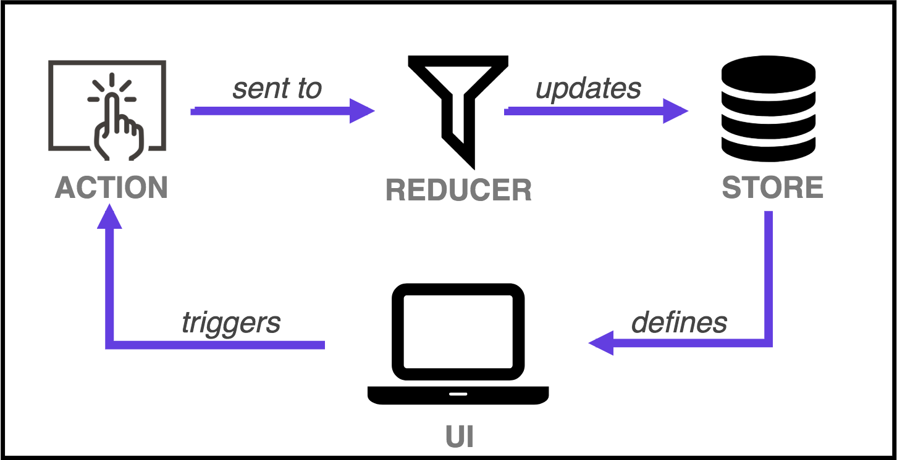
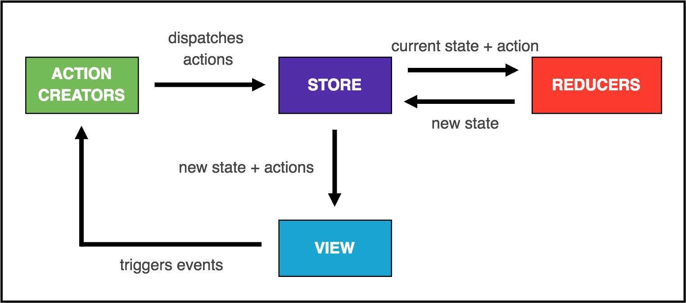

# Managing your application state with Redux

In this exercise, we will review what we did in the previous Exercise and we'll analyze together the technical debt, and the limitations of the strategy we used to manage data between components (Parent-Child components and component state). Then, we will propose another strategy best-suited for medium/large applications (Redux) and we'll talk about the tradeoffs of this new approach.

## Introduction: A quick recap

> **Note:** For this exercise, you need [Redux devtools in your browser](https://github.com/zalmoxisus/redux-devtools-extension#installation). Follow the steps in the link and install it before continuing with this section.

Let's talk first about what we learned so far. We know that a React application consists of a set of **components** that receive of a set of input, read-only **props** and produce **JSX** code with them. If any of this properties change, new **JSX** may be generated. When users interact with your components, information is passed to the upper levels by executing functions also received via **props**, following the [container and presentational components pattern](https://medium.com/@dan_abramov/smart-and-dumb-components-7ca2f9a7c7d0).


Take a minute to understand the paragraph above. It can be summarized in these two sentences:

- In React, **data is unidirectional**, meaning that it flows in one direction, from parent to child.
- User interaction is translated into **events** that execute our custom code.

### And what about the state?

In Exercise 2, we learned how to store information in the component's local state using `this.state` and `this.setState()` and, following the [container and presentational components pattern](https://medium.com/@dan_abramov/smart-and-dumb-components-7ca2f9a7c7d0), it's best to centralize this information in the Parent component's state. We also learned that `this.setState()` would potentially execute a `render()` **re-painting the component and all of its children**.

Consider the following component structure:

- We have a root component, **A**, in charge of rendering three children: **A.0**, **A.1** and **A.2**.
- Similarly, **A.0** is composed of two components: **A.0.0** and **A.0.1**.


With this in mind, analyze the following scenarios:

1. Let's say that we followed the [container and presentational components pattern](https://medium.com/@dan_abramov/smart-and-dumb-components-7ca2f9a7c7d0) _"to the letter"_ and all the logic is held in the **A** parent component (smart) and the rest are presentational (dumb).

   

   When a user interaction updates the state, data will flow all the way up to the **A** component. The `this.setState()` method will be executed at the root level, _forcing a re-render of all five children components_, even if we need only one to change. This behavior of React components, the need to re-render the component and its children, is called **cascading rendering** (or _cascading updates_).

   It's easy to understand that, by using this approach, performance is lost in favor of code simplification.

1. Now, let's say we move some state to **A0**, adding some smart logic to it at the same time. Now, when the **this.setState()** method is called in this component, it will only cause a re-render of its two children.

   

   This approach **improves the cascading rendering situation a little bit**, only re-rendering two components instead of five when we potentially need only one to render. The tradeoff is that we have to split the logic and move it to other places.

   This improvement works well with a small subset of components. But does it scale?

You can imagine that a real-world application has dozens of components and having to make this analysis several times in certainly an overkill. At this point you should be asking yourself if there is something that would help you to simplify the state management of your app. In other words, how can you reduce the loss of performance due to the cascading rendering and, at the same time, unify all the logic in a single place.

## Section 1: Introducing Redux

[Redux](https://redux.js.org/introduction/threeprinciples) is a simple library that proposes a very simple approach to manage your state. Although it introduces several new concepts, it can be described in three core concepts (that we already know about):

- **Single source of truth**: The state of your whole application is stored in an object tree within a single store.
- **State is read-only**: The only way to change the state is to emit an action, an object describing what happened.
- **Changes are made with pure functions**: To specify how the state tree is transformed by actions, you write pure reducers.


> **Note:** There is a lot to learn about Redux and this course could not cover everything. If you want to know more, we suggest that you should start from the [basics](https://redux.js.org/basics).

### The Shopping cart app

We created a simple shopping cart application to demonstrate the basic concepts of state management and user interaction. This application uses everything we've learned so far, and the plan today is to take it to the next level with the help of Redux. But before doing that, let's do a quick review of the app:

1. Open the _Shopping cart app_ located in the **begin/shopping-app** folder of this Exercise.
1. In the terminal, and navigate to the root folder and run `npm i` to install all the dependencies.
1. While this command is being executed, take a few minutes to analyze the folder structure and the main components.

   - First, we have a _src/index.tsx_ file, the entry point of our app, in charge of rendering the main `<App />` component in the DOM node.
   - The `<App />` component (_src/components/App/index.tsx_ file) holds the main logic of this app, and following the [container and presentational components pattern](https://medium.com/@dan_abramov/smart-and-dumb-components-7ca2f9a7c7d0), it's in charge of several things, from displaying the displaying the main presentational components to reacting to user interaction.
   - Then we have two presentational components, `<TopBar />` and `<ShoppingCart />`, that receive everything they need from its parent.
   - Finally, notice that the `<TopBar />` component has sub-components, with clear responsibilities.

1. After everything is installed, open the terminal in the root folder of the app run `npm start`. Click the _Remove_ button and see that both the list and the count indicator at the top right are affected by this.

   

Notice that the scenario proposed is similar to what we discussed before. To sum it up, if something changes in the `<ShoppingCart />` component, we will re-render everything (although, in this case, we need it). In the next step, we will install Redux and move some of the logic of the `<App />` component to somewhere else.

## Section 2: Migrating to Redux

In this section, we will go through the steps needed to migrate from the local component state management to Redux. For this, we will use a simple shopping cart application.

1. Let's start by installing the packages we need. We'll go through all of them later, for now, just run `npm i -S redux react-redux redux-actions redux-thunk-promise`.
1. And their definition files: `npm i -D @types/redux @types/react-redux @types/redux-actions`.

   > **Note:** A definition file contains the types and declarations of a particular JS library that was not written in TypeScript. They are part of the [open-source project Definitely typed](https://github.com/DefinitelyTyped/DefinitelyTyped), maintained by the TS community that, as of today, has 4000+ definition files.

### Actions and reducers

Redux proposes the use of two new type of entities to organize our business logic:

- **Actions**, to connect the user interaction with the manipulation of the state. Actions will be "dispatched" when someone interacts with the application, sending the required information to do something about it.
- **Reducers**: to generate a new state based on the information sent by an action. The return value of a reducer is stored in the Redux global state, amd it usually represents a little piece of our global state, a _node_.



Open the **src/domains** folder. In there, you should see a **user** folder, containing an **actions.ts** and **reducers.ts** file. This folder mimics our state tree. In the next steps, we are going to learn how to implement logic to store the user information in the Redux's **user node**, like the User ID or the Shopping Cart items.

1. Open the **actions.ts** file.
1. We are going to create two actions: an _async_ action to fetch items from the backend and _sync_ action to remove items from the user's shopping cart. For this, we are going to take advantage of the `createAction()` method of the "redux-actions" library, which only requires an _action type_ and, optionally, a function that will (eventually) return the payload of the action, named as _payload creator_:

   ```js
   import { createAction } from "redux-actions";
   import usersService from "../../services/users-service";

   const FETCH_SHOPPING_CART_ITEMS = "FETCH_SHOPPING_CART_ITEMS";
   const REMOVE_SHOPPING_CART_ITEM = "REMOVE_SHOPPING_CART_ITEM";

   const fetchShoppingCartItems = createAction(FETCH_SHOPPING_CART_ITEMS, usersService.getUserShoppingCartItems);
   const removeShoppingCartItem = createAction(REMOVE_SHOPPING_CART_ITEM);

   export default {
     FETCH_SHOPPING_CART_ITEMS,
     REMOVE_SHOPPING_CART_ITEM,
     fetchShoppingCartItems,
     removeShoppingCartItem
   };
   ```

   As you see, both synchronous and asynchronous actions are straightforward. The only difference is that, for async actions, you need to implement a function that returns a promise. And, when resolved, retrieves a payload, similarly to a sync action. We'll see how later.

   > **Note:** Actions are plain JavaScript objects that have a unique `type` property that identifies the action being performed. They are used to dispatch (or send) payloads of information to your store. You can learn more about actions [here](https://redux.js.org/basics/actions).

1. Next, open the **reducers.ts** file.
1. We now need to model our user's state node by defining the properties of this node. And the logic in charge of storing new information in these properties when an action is executed. Since we defined two actions, it makes sense to define two reducers:

   ```js
   import { handleActions } from 'redux-actions';
   import actions from './actions';

   const initialState = {
     shoppingCartItems: [],
     userId: 'user-id',
   };

   export default handleActions({
     [actions.FETCH_SHOPPING_CART_ITEMS]: (state: any, action: any) => {
       const items = action.payload;
       return {
         ...state,
         shoppingCartItems: items,
       };
     },

     [actions.REMOVE_SHOPPING_CART_ITEM]: (state: any, action: any) => {
       const itemToRemoveId = action.payload as string;
       const filteredItems = state.shoppingCartItems.filter((item: any) => item.id !== itemToRemoveId)

       return {
         ...state,
         shoppingCartItems: filteredItems
       };
     },
   }, initialState);
   ```

   These are the important pieces of this code:

   - It defines an initial state, similar to what the `<App />` component defines as its internal state (if you haven't checked this component yet, take a look at it now).
   - It doesn't mutate the state. Instead, it creates a copy of it. This is an important rule that you need to honor in the reducers.
   - Although it does generate shallow copies of the state nodes (by using `...state`) only performs localized updates.

   > **Note:** Reducers specify how the application's state changes in response to actions sent to the store. Remember that actions only describe what happened, but don't model how the application's state changes. Find out more about them [here](https://redux.js.org/basics/reducers).

1. Last, open the **index.ts** file inside the **src/domains** folder. Notice that the code connects the `userReducers` object with the `user` propoerty. This is how we (later) tell Redux that the reducers we defined will only touch the user's node, receiving only this portion of the state and only allowed to update this portion of the state. As your app grows, you will create new state nodes with different _actions_ and _reducers_ associated with them.

   > **Note:** If you follow this convention, you've probably noticed that for new state nodes you' only need to copy and paste the user's folder.

### Removing the state from the App component

As we moved the state logic into a different set of entities (actions and reducers), we can now simplify the `<App />` component by reducing its responsibilities. Let's start with its contract

1. Open the **src/components/App/types.ts** file and replace the `IProps` and `IState` interfaces with the following code. Note that we are merging these two interfaces because we will receive both the _state_ and the _actions_ via **props**.

   ```js
   export interface IProps {
     shoppingCartItems: IProduct[];
     userId: string;
     fetchUserShoppingCartItems: (userId: string) => Promise<IProduct[]>;
     onRemoveShoppingCartItem: (itemId: string) => any;
   }
   ```

1. Open the **src/components/App/App.tsx** file and apply the following changes to completely remove the state from this component:

   1. Replace the import of types with `import { IProps } from './types';`.
   1. Update the class definition with `class App extends React.Component<IProps, {}>`.
   1. Remove the line in the `constructor()` that initializes the state:

   ```js
   class App extends React.Component<IProps, {}> {
     constructor(props: any) {
       super(props);
     }
     ...
   }
   ```

   1. Last, update from where it gets the shopping cart items in the `render()` method as it will now get them from **props**:

   ```js
   public render() {
     const pages = this.getPages();
     const { shoppingCartItems } = this.props;

     ...
   }
   ```

1. Modify the code inside the `handleRemoveShoppingCartItem()` method with code to execute an **action** (received via **props**).

   ```js
   public handleRemoveShoppingCartItem = (itemToRemoveId: string) => {
     const { onRemoveShoppingCartItem = (id: string) => id } = this.props;
     onRemoveShoppingCartItem(itemToRemoveId);
   }
   ```

1. Repeat the same for the `componentDidMount()` method. Remove the code that initializes the fetching of the shopping cart items with an execution of a function:

   ```js
   public componentDidMount() {
     const { userId, fetchUserShoppingCartItems = (id: string) => Promise.resolve([]) } = this.props;
     fetchUserShoppingCartItems(userId);
   }
   ```

1. The last part is to update from where we get the shopping cart items in the `render()` method. You can do that by simply changing that we are getting the values from `props` instead of `state`.

We are almost there!

### Connecting the global state with the App component

We now need to create the file that will enhance the `<App />` component by injecting the **state** and the **actions** that we created int he previous steps. These files are usually named **Container** components, and as you may remember, they store the intelligence (business logic) of your app.

1. Create a new file named **src/components/App/App.container.ts** and paste the following code:

   ```js
   import { connect } from "react-redux";
   import { actions } from "../../domains";
   import App from "./App";

   const mapStateToProps = (state: any) => ({
     shoppingCartItems: state.user.shoppingCartItems,
     userId: state.user.userId
   });

   const mapDispatchToProps = (dispatch: any) => ({
     fetchUserShoppingCartItems: (userId: string) => dispatch(actions.fetchShoppingCartItems(userId)),
     onRemoveShoppingCartItem: (itemId: string) => dispatch(actions.removeShoppingCartItem(itemId))
   });

   export default connect(
     mapStateToProps,
     mapDispatchToProps
   )(App);
   ```

   In a Redux application, the **Container** component is only in charge of setting up all the information the (dumb) component requires to work. In most of the cases, it only means:

   - Mapping the Redux state with the component's props.
   - Mapping the Redux actions with the component's props, and dispatching them when executed.

   The rest of the code is sugar syntax to simplify the connection of your component with Redux.

   > **Note:** Create container components only when it's convenient for you, and use regular **state** by default. The rule of thumb is that when you feel that you're duplicating code in parent components by cascading props several times, it's time to use a container. Or when the number of props in a parent container grows too much.

1. Last, update the **src/components/App/index.ts** file to expose the container to the outside instead of the component:

   ```js
   import App from "./App.container";
   export default App;
   ```

### Configuring the Redux store

The last step of the puzzle is to initialize your app and connect it with Redux.

1. Open the **src/index.tsx** file.
1. Uncomment the code. Notice that we import the Redux library, other Reudx utilities and _all the reducers inside the domains folder_.
1. Next, create your store by passing your reducers to the `createStore()` function, and extend it with middlewares and other developer tools:

   ```js
   const composeEnhancers = (window as any).__REDUX_DEVTOOLS_EXTENSION_COMPOSE__ || compose;
   const store = createStore(
     combineReducers(reducers),
     composeEnhancers(applyMiddleware(thunkPromiseMiddleware)),
   );
   ```

   > **Note:** Middlewares extends the functionality of the Redux store, by executing custom code while an action is being dispatched. Redux does not support _async actions_ by default, and this is why we are enhancing it with [Redux thunk promise](https://medium.com/@nanovazquez/redux-thunk-promise-thunk-and-fsa-compliant-promise-middleware-for-redux-fad10a941708), a middleware to perform FSA-compliant async actions. If you want to know more about how to configure your store, Redux devtools and middlewares, see [here](https://redux.js.org/recipes/configuringyourstore).

1. Finally, replace the current `ReactDOM.render` lines with the following:

   ```js
   ReactDOM.render(
     <Provider store={store}>
       <App />
     </Provider>,
     document.getElementById('root') as HTMLElement
   );
   ```

   > **Note:** A [Provider](https://github.com/reduxjs/react-redux/blob/master/docs/api.md#provider-store) is a container component that enables your presentational components to connect with the Redux store. It's the one that let's you receive both the `state` and `dispatch` in the `mapStateToProps()` and `mapDispatchToProps()` functions, respectively.

And the migration is complete! The application is now working the same way it was working before, but with Redux 🚀🚀. Take a few minutes to play with the app and understand what how the data flows in a Redux-powered application.



## Section 3: Evolving your Redux app

We are now going to extend the application functionality by creating two simple actions: a (sync) action to add items to the shopping cart and an (async) action to fetch new items to display. To do this, follow these steps:

1. Open the **src/services/users-service.ts** file and add the following method to return all items. And don't forget also to export it.

   ```js
   const dummyProducts = [
     ...
   ];
   ...

   function getAllItemsByUser(userId: string) {
     // Of course, we'll mock this action, as we don't have a backend set up for this Exercise.
     return Promise.resolve(dummyProducts);
   }

   export default {
     getAllItemsByUser,
     getUserShoppingCartItems,
   }
   ```

1. Next, open the **src/domains/user/actions.ts** and add the new action types. As before, don't forget to export everything:

   ```js
   ...
   const ADD_SHOPPING_CART_ITEM = 'ADD_SHOPPING_CART_ITEM';
   const FETCH_ALL_ITEMS = 'FETCH_ALL_ITEMS';
   const fetchAllItems = createAction(FETCH_ALL_ITEMS);
   const addShoppingCartItem = createAction(ADD_SHOPPING_CART_ITEM);

   export default {
     ADD_SHOPPING_CART_ITEM,
     FETCH_ALL_ITEMS,
     ...
     fetchAllItems,
     addShoppingCartItem
   };
   ```

1. Now it's the turn of the reducer. Add the new logic showed below in the **src/domains/user/reducers.ts** file. Notice that we will update the initial state as well.

   ```js
   ...

   const initialState = {
     allItems: [],
     shoppingCartItems: [],
     userId: 'user-id',
   };

   export default handleActions({
     [actions.ADD_SHOPPING_CART_ITEM]: (state: any, action: any) => {
       const newItem = action.payload;
       return {
         ...state,
         shoppingCartItems: [].concat(...state.shoppingCartItems, newItem)
       };
     },

     [actions.FETCH_ALL_ITEMS]: (state: any, action: any) => {
       const items = action.payload;
       return {
         ...state,
         allItems: items,
       };
     },

     ...
   }, initialState);
   ```

And that's it! Although we don't have the pages to perform these actions, we could take advantage of Redux devtools to _dispatch_ actions within the browser. For this, open the **Developer tools**, go to the **Redux** tab and click the **Dispatch** button. If you dispatch this action, you will see a new item in your shopping cart.

```js
{
  type: 'ADD_SHOPPING_CART_ITEM',
  payload: { id: '100', name: 'Max the mule', price: 'free', imageUrl: 'https://swag.mulesoft.com/images/items/MU00-5000.jpg' }
}
```

#### Result


You can also generate a new node to store all the items your Shopping app could have by dispatching the following action:

```js
{
  type: 'FETCH_ALL_ITEMS',
  payload: [{ id: '100', name: 'Max the mule', price: 'free', imageUrl: 'https://swag.mulesoft.com/images/items/MU00-5000.jpg' }]
}
```

#### Result


🎉🎉🎉

### Wrapping up

In this section, we learned the following:

- How to migrate from the local component state to Redux, by creating `actions` and `reducers`.
- How to connect the Redux store with our components, through containers.
- How to create new sync and async actions.
- How to configure a Redux store in an app.
- How to trigger new actions to the store.
