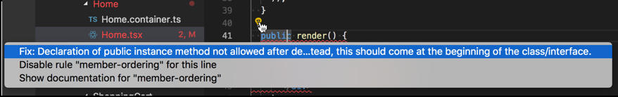
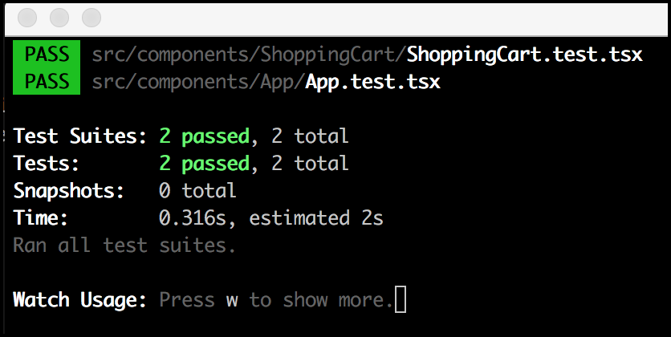
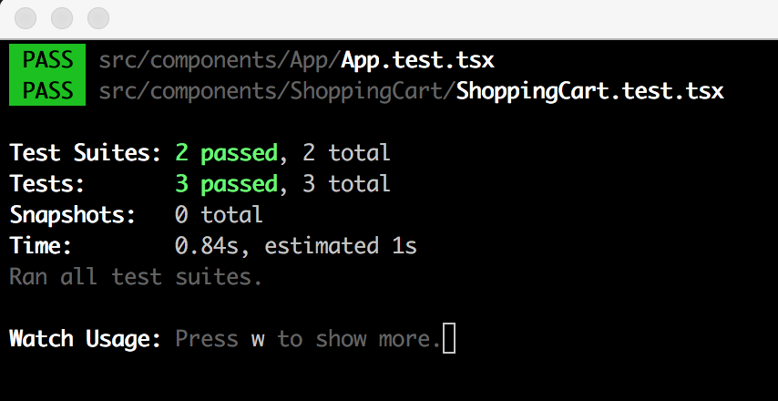
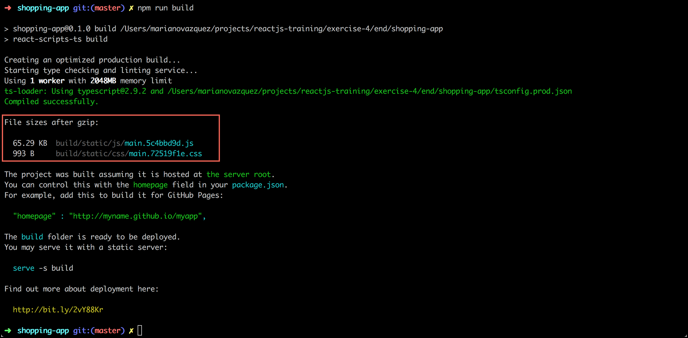

# Everything you need to know to go to PROD

In this exercise, we will learn how we can fix the code we write and validate it using tests. Then, we will talk about the steps needed to generate an artifact and deploy it to an environment. Last, we will review best practices and advanced topics that were inquired while doing the previous exercises.

## Section 1: Continuos integration + Continuos delivery (CI/CD)

The [Microsoft's TypeScript Create React app project](https://github.com/facebook/create-react-app) is a set of curated scripts to create React applications. By using this tool, we can bootstrap applications with the following built-in features:

* A ready-to-be-used development experience as similar to production as possible (`npm start`).
* A build script, configured and optimized for high performance (`npm run build`).
* A unit testing framework (npm run test) with code coverage already configured (`npm run test`).
* Latest tools, linter (npm run lint) and best practices for web development.

We used this tool to set up the apps in the previous exercises quickly. We are now going to extend this tool to allow a continuous delivery process.

### Static analysis

Our app is already configured with [TSLint](https://palantir.github.io/tslint/), an extensible static analysis tool that checks TypeScript code for readability, maintainability and functionality errors.


As you've seen in the previous exercises, VSCode and most of the IDEs already know how to run it. Let's create a script to run these checks in our CI/CD pipeline:

1. Open the **package.json** file and find the **scripts** property.
1. Paste the following line to a new script named **lint**. Save the file.

    ```
    "scripts": {
      "lint": "./node_modules/.bin/tsc && ./node_modules/.bin/tslint src/**/*.ts*",
      ...
    }
    ```

1. Open a terminal and run `npm run lint`. You should see no errors.

    **What did we just do?** We've just created an npm script that will run _tsc_ (the compiler) and _tslint_ (the static checker) for all the _.ts_ and _.tsx_ files inside the _src_ folder. All errors you see before in VSCode are generated by running these two tools behind the scenes, per file. This script will run for all your files, and it will output all the errors you need to fix before moving forward.

Of course, to understand the full power of this tool, we need to generate a few errors.

1. Open the **src/Home/Home.tsx** file.
1. In line 15, rename the `handleItemsClick` method to `handleItemsClicks`. Notice that an error is present in line 33.
1. Now, execute `npm run lint`. You should see an error like the following:

    

1. Undo the change and now change the modifier of the `renderProducts()` method to **private**. You will see a bunch of errors related to the order of the class members.
1. The good thing about these tools is that they can fix some errors automatically. Try this by either clicking the light bulb and selecting the **Fix this** option or by running `npm run lint -- --fix`.

    

> **Note:** If you want to know more about the rules that are enforced in the static analysis, you can search the rulesets defined in the _extends_ property of the **tslint.json**. For instance, these are the rules defined for the [tslint-react](https://github.com/palantir/tslint-react) ruleset.

_Pro tip! Your newly created script will help you to fix a significant amount of annoying issues at once._

### Unit testing

Unit testing your code is just one command away: `npm run test`. By running this, you will execute [Jest](https://jestjs.io/), the de-facto unit testing utility for React applications. This tool will execute all tests inside the _*.test.ts_ or _*.spec.ts_ files. We already have one test in place, let's see how it works:

1. In the root folder of the exercise, run `npm run test`. It won't work as you haven't set up anything yet.
1. Let's start with a basic test instead. With `npm run test` still running, replace the entire `it()` method with the following:

    ```js
    it('returns the proper page', () => {
      const app = new App({ pathname: '/' });
      const result = app.getPages();

      expect(result.length).toBe(1);
      expect(result[0].name).toBe('Home');
      expect(result[0].url).toBe('/');
    });
    ```

    You should see now a green result for your tests suite.

    

**Have you noticed?** Unit testing in the UI is pretty similar to what you do in the backend. This applies to _almost_ all methods in your classes. The only difference resides in the extra step you need to validate in the React components, the rendering phase.

Consider the `<ShoppingCart />` component:
1. It is instantiated with the items in the cart, like `<ShoppingCartStatus items={items} />`.
1. If `items` is undefined or there are no items, it should render an empty message.
1. If there are `items`, it should render all of them.

To test the component, we have two options: render your component in a browser or simulate the rendering with a JavaScript tool like [Enzyme](https://airbnb.io/enzyme/) (faster). Let's see it in action.

1. Install Enzyme and other dev dependencies by running `npm i -D enzyme @types/enzyme enzyme-adapter-react-16 @types/enzyme-adapter-react-16 react-test-renderer`.

    > **Note:** We've just installed `enzyme` and the package with its declaration files, `@types/enzyme`. The other two packages are needed to configure Enzyme correctly, as we will see in the next step.

1. Now create the file **src/setup-tests.ts** that will be automatically loaded when running tests. This file will configure Enzyme to work with React 16.

    ```js
    import * as enzyme from 'enzyme';
    import * as Adapter from 'enzyme-adapter-react-16';

    enzyme.configure({ adapter: new Adapter() });
    ```

1. Last, go to the **src/components/ShoppingCart** folder and create a test file named **ShoppingCart.test.tsx**.
1. Paste the following `import` statements inside the newly created file:

    ```js
    import * as React from 'react';
    import { shallow } from 'enzyme';
    import ShoppingCart from './ShoppingCart';
    ```

    > **Note:** `shallow` is a function that allows you to test your component as a unit, by executing a shallow rendering of it (and not rendering its children React components). You can learn more about it [here](https://airbnb.io/enzyme/docs/api/shallow.html)/

1. Let's add our first test to validate that the `<ShoppingCart />` component will render an empty message if it doesn't receive items. If you don't have Jest running in _watch mode_ by now, execute it by running `npm run test`.

    ```js
    it('renders the empty state if there are no items', () => {
      const wrapper = shallow(<ShoppingCart />);
      expect(wrapper.find('.shopping-cart-empty').exists()).toBeTruthy();
      expect(wrapper.find('.shopping-cart-empty').text()).toBe('No items');
    });
    ```

    Check that this test passes before going to the next step.

    

Now, we'll add a test to validate if items are rendered as they should, and all the DOM elements are filled with the proper information.

1. For this, create the following empty test case:

    ```js
    it('renders items', () => {
      const items = [
        { id: '1', name: 'test-1', price: '$10', imageUrl: 'imageUrl' },
        { id: '2', name: 'test-1', price: '$10', imageUrl: 'imageUrl' },
      ];
    });
    ```

1. Below the `items` array, add the following lines to validate that, when rendered with items, the `<ShoppingCart />` component doesn't render the empty message and, instead, it renders the shopping cart items.

    ```js
    it('renders items', () => {
      ...
      const wrapper = shallow(<ShoppingCart items={items} />);
      expect(wrapper.find('.shopping-cart-empty').exists()).toBeFalsy();

      const shoppingCartItems = wrapper.find('.shopping-cart-items');
      expect(shoppingCartItems.exists()).toBeTruthy();
    });
    ```

1. Finally, add this code to validate that each value of the shopping cart items are properly rendered:

    ```js
    it('renders items', () => {
      ...

      shoppingCartItems.find('.shopping-cart-item').map((shoppingCartItem, index) => {
        expect(shoppingCartItem.exists()).toBeTruthy();
        expect(shoppingCartItem.key()).toBe(items[index].id);
        expect(shoppingCartItem.find('.shopping-cart-item-name').text()).toBe(items[index].name);
        expect(shoppingCartItem.find('.shopping-cart-item-price').text()).toBe(items[index].price);
        expect(shoppingCartItem.find('.shopping-cart-item-image').prop('src')).toBe(items[index].imageUrl);
      });
    });
    ```

    If you are not executing Jest in your terminal, validate all suites pass by running `npm run test`.

    


Finally, Jest has a way to record calls to a function, [just like a sinon spy](https://sinonjs.org/releases/v4.0.0/spies/), named **mocked functions**. To play with this feature, create a new test to validate that the `onItemRemove()` function is called when removing an item.

1. Start by adding the following empty test case:

    ```js
    it('calls onItemRemove when an item is removed', () => {
      const items = [
        { id: '1', name: 'test-1', price: '$10', imageUrl: 'imageUrl' },
        { id: '2', name: 'test-1', price: '$10', imageUrl: 'imageUrl' },
      ];
    });
    ```

1. Set up the mocked function and initialize the wrapper with the `items` and the `onItemRemoveSpy` values as props.

    ```js
    it('calls onItemRemove when an item is removed', () => {
      ...
      const onItemRemoveSpy = jest.fn();
      const wrapper = shallow(<ShoppingCart items={items} onItemRemove={onItemRemoveSpy} />);
    });
    ```

    **Note:** Mock functions make it easy to test the links between code by erasing the actual implementation of a function, capturing calls to the function (and the parameters passed in those calls) and allowing test-time configuration of return values. If you want to know more about this function, see [here](https://jestjs.io/docs/en/mock-functions).

1. Simulate a `click` of a remove link and validate that the mocked function is called afterwards with this code:

    ```js
    it('calls onItemRemove when an item is removed', () => {
      ...

      const evt = { preventDefault: () => {}, currentTarget: { dataset: { id: items[0].id } } };
      wrapper.find('.shopping-cart-item-remove').first().simulate('click', evt);
      expect(onItemRemoveSpy).toBeCalledWith(items[0]);
    });
    ```

    

    > **Note:** As its name states, [simulate](https://airbnb.io/enzyme/docs/api/ShallowWrapper/simulate.html) is a very useful tool to simulate events and user interaction. If you review the `ShoppingCart.handleItemRemove()` method, you will notice that it uses the `evt` object internally twice. To execute our tests, We need to mock this object too.

_Pro tip! Always the Jest's watch mode to fix your tests on the fly. Jest will automatically run as soon as it detects changes._

### Build a release candidate

When running the project with `npm run start`, we want our code to be executed as fast as possible, and having development-time tools that will simplify troubleshooting, like [source maps](https://www.html5rocks.com/en/tutorials/developertools/sourcemaps/). On the opposite, when creating our production build, we want our code to be as fast and small as possible, something that specific optimizations like minification can accomplish.

We typically build our app using a _development_ and a _production_ mode, generating different artifacts to cover different needs. In our case, we create our artifact by running `npm run build`. This script will run several checks and compilation processes to generate a curated, production-ready artifact that we can use to deploy to any environment.

1. Open a terminal in the root folder of the app and execute `npm run build`.
1. Fix all the errors until you get something like this:

    

    > **Note:** An static application was generated in the **build** folder. Your business logic files were merged into a single file per type, in this case, a single JS and CSS file.

1. [serve](https://github.com/tj/serve) is a simple command-line web server built. Install it by running `npm i -g serve`.
1. When it is installed, test your app by running `serve -s build`.

    

1. Navigate to http://localhost:5000 and validate that your app is running just like it was when you executed `npm run start`.
1. Open the **Network** tab in the Developers console and refresh the page. Take a look at the requested files.

As shown, the artifact generated is ready to be used by any web server, like Amazon CloudFront or event a Node Express Server.

### CI/CD

These scripts an be orchestrated to progressively validate our code, that will ultimately be deployed into a service. Several automation servers can execute these and other scripts every time we perform specific actions, like opening a PR or merging code into master.


As an example, below you could find a file that Jenkins could run to validate your code, generate an artifact and deploy it to a CDN, stopping the pipeline if any of these scripts fail.

```groovy
node {

  stage('Run lint') {
    run 'npm run lint'
  }

  stage('Run tests') {
    run 'npm run test'
  }

  stage('Build artifact') {
    run 'npm run build'
  }

  stage('Upload artifact to CDN') {
    ...
  }

}
```

## Section 2: Advanced topics

Some good practices
  Short circuit evaluation
  Destructuring assignment https://developer.mozilla.org/en-US/docs/Web/JavaScript/Reference/Operators/Destructuring_assignment
  Object spread operator https://redux.js.org/recipes/usingobjectspreadoperator
  Inmutable update patterns https://redux.js.org/recipes/structuringreducers/immutableupdatepatterns
  Actions and reducers https://redux.js.org/basics/reducers#handling-actions
  CSS processors provided

Files structure

Redux and data
  Reducers: https://redux.js.org/recipes/structuringreducers
  Normalize data

Selectors
  Reselect library
  Selectors can compute derived data, allowing Redux to store the minimal possible state.
  Selectors are composable. They can be used as input to other selectors.
  Reselect Selectors are efficient. A selector is not recomputed unless one of its arguments change.


