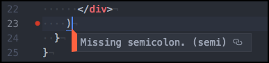
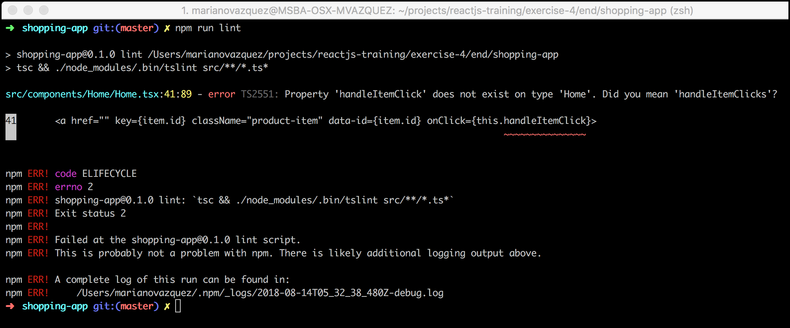
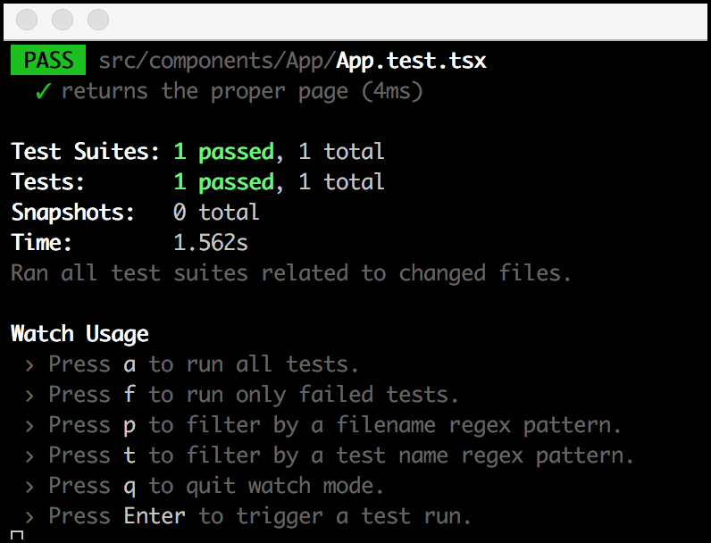
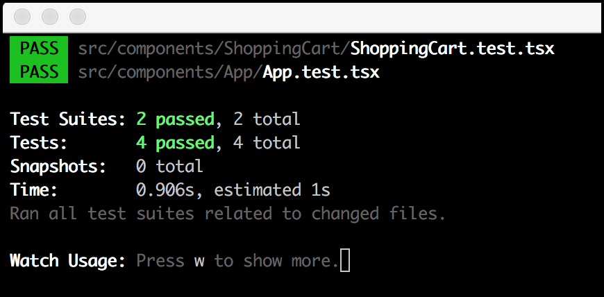
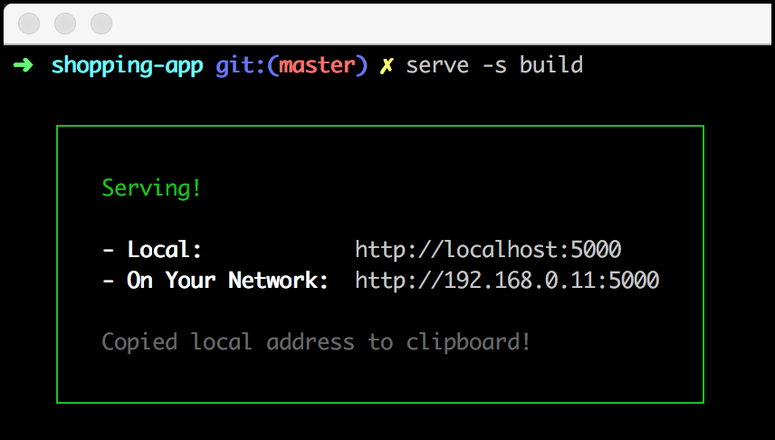

# CI/CD + Advanced topics

In this exercise, we will learn how we can fix the code we write and validate it using tests. Then, we will talk about the steps needed to generate an artifact and deploy it to an environment. Last, we will review best practices and advanced topics that were inquired while doing the previous exercises.

## Section 1: Continuos integration + Continuos delivery (CI/CD)

The [Microsoft's TypeScript Create React app project](https://github.com/facebook/create-react-app) is a set of curated scripts to create React applications. By using this tool, we can bootstrap applications with the following built-in features:

- A ready-to-be-used development experience as similar to production as possible (`npm start`).
- A build script, configured and optimized for high performance (`npm run build`).
- A unit testing framework (npm run test) with code coverage already configured (`npm run test`).
- Latest tools, linter (npm run lint) and best practices for web development.

We used this tool to set up the apps in the previous exercises quickly. We are now going to extend this tool to allow a continuous delivery process.

### Static analysis

Our app is already configured with [TSLint](https://palantir.github.io/tslint/), an extensible static analysis tool that checks TypeScript code for readability, maintainability and functionality errors.



As you've seen in the previous exercises, VSCode and most of the IDEs already know how to run it. Let's create a script to run these checks in our CI/CD pipeline:

1. Navigate to the project located in the **begin** folder of this exercise.
1. Run `npm i` to install all its dependencies.
1. Open the **package.json** file and find the **scripts** property.
1. Paste the following line to a new script named **lint**. Save the file.

   ```
   "scripts": {
     "lint": "./node_modules/.bin/tsc && ./node_modules/.bin/tslint src/**/*.ts*",
     ...
   }
   ```

1. Open a terminal and run `npm run lint`. You should see no errors.

   **What did we just do?** We've just created an npm script that will run _tsc_ (the compiler) and _tslint_ (the static checker) for all the _.ts_ and _.tsx_ files inside the _src_ folder. All errors you see before in VSCode are generated by running these two tools behind the scenes, per file. This script will run for all your files, and it will output all the errors you need to fix before moving forward.

Of course, to understand the full power of this tool, we need to generate a few errors.

1. Open the **src/Home/Home.tsx** file.
1. In line 15, rename the `handleItemClick` method to `handleItemClicks`. Notice that an error is present in line 33.
1. Now, execute `npm run lint`. You should see an error like the following:

   

1. Undo the change and now change the modifier of the `renderProducts()` method to **private**. You will see a bunch of errors related to the order of the class members.
1. The good thing about these tools is that they can fix some errors automatically. Try this by either clicking the light bulb and selecting the **Fix this** option or by running `npm run lint -- --fix`.

   

> **Note:** If you want to know more about the rules that are enforced in the static analysis, you can search the rulesets defined in the _extends_ property of the **tslint.json**. For instance, these are the rules defined for the [tslint-react](https://github.com/palantir/tslint-react) ruleset.

_Pro tip! Your newly created script will help you to fix a significant amount of annoying issues at once._

### Unit testing

Unit testing your code is just one command away: `npm run test`. By running this, you will execute [Jest](https://jestjs.io/), the de-facto unit testing utility for React applications. This tool will execute all tests inside the _\*.test.ts_ or _\*.spec.ts_ files. We already have one test in place, **App.test.tsx**, let's see how it works:

1. In the root folder of the exercise, run `npm run test`. It won't work as you haven't set up anything yet.
1. Now, with `npm run test` still running, replace the entire `it()` method of the **src/components/App/App.test.tsx** file with the following:

   ```js
   it("returns the proper page", () => {
     const app = new App({ pathname: "/" });
     const result = app.getPages();

     expect(result.length).toBe(1);
     expect(result[0].name).toBe("Home");
     expect(result[0].url).toBe("/");
   });
   ```

   You should see now a green result for your tests suite.

   

**Have you noticed?** Unit testing in the UI is pretty similar to what you do in the backend. This applies to _almost_ all methods in your classes. The only difference resides in the extra step you need to validate in the React components, the rendering phase.

Consider the `<ShoppingCart />` component:

1. It is instantiated with the items in the cart, like `<ShoppingCartStatus items={items} />`.
1. If `items` is undefined or there are no items, it should render an empty message.
1. If there are `items`, it should render all of them.

To test the component, we have two options: render your component in a browser or simulate the rendering with a JavaScript tool like [Enzyme](https://airbnb.io/enzyme/) (faster). Let's see it in action.

1. Install Enzyme and other dev dependencies by running `npm i -D enzyme @types/enzyme enzyme-adapter-react-16 @types/enzyme-adapter-react-16 react-test-renderer`.

   > **Note:** We've just installed `enzyme` and the package with its declaration files, `@types/enzyme`. The other two packages are needed to configure Enzyme correctly, as we will see in the next step.

1. Now create the file **src/setupTests.ts** that will be automatically loaded when running tests. This file will configure Enzyme to work with React 16.

   ```js
   import * as enzyme from "enzyme";
   import * as Adapter from "enzyme-adapter-react-16";

   enzyme.configure({ adapter: new Adapter() });
   ```

1. Last, go to the **src/components/ShoppingCart** folder and create a test file named **ShoppingCart.test.tsx**.
1. Paste the following `import` statements inside the newly created file:

   ```js
   import * as React from "react";
   import { shallow } from "enzyme";
   import ShoppingCart from "./ShoppingCart";
   ```

   > **Note:** `shallow` is a function that allows you to test your component as a unit, by executing a shallow rendering of it (and not rendering its children React components). You can learn more about it [here](https://airbnb.io/enzyme/docs/api/shallow.html)/

1. Let's add our first test to validate that the `<ShoppingCart />` component will render an empty message if it doesn't receive items. If you don't have Jest running in _watch mode_ by now, execute it by running `npm run test`.

   ```js
   it("renders the empty state if there are no items", () => {
     const wrapper = shallow(<ShoppingCart />);
     expect(wrapper.find(".shopping-cart-empty").exists()).toBeTruthy();
     expect(wrapper.find(".shopping-cart-empty").text()).toBe("No items");
   });
   ```

   Check that this test passes before going to the next step.

   

Now, we'll add a test to validate if items are rendered as they should, and all the DOM elements are filled with the proper information.

1. For this, create the following empty test case:

   ```js
   it("renders items", () => {
     const items = [{ id: "1", name: "test-1", price: "$10", imageUrl: "imageUrl" }, { id: "2", name: "test-1", price: "$10", imageUrl: "imageUrl" }];
   });
   ```

1. Below the `items` array, add the following lines to validate that, when rendered with items, the `<ShoppingCart />` component doesn't render the empty message and, instead, it renders the shopping cart items.

   ```js
   it('renders items', () => {
     ...
     const wrapper = shallow(<ShoppingCart items={items} />);
     expect(wrapper.find('.shopping-cart-empty').exists()).toBeFalsy();

     const shoppingCartItems = wrapper.find('.shopping-cart-items');
     expect(shoppingCartItems.exists()).toBeTruthy();
   });
   ```

1. Finally, add this code to validate that each value of the shopping cart items are properly rendered:

   ```js
   it('renders items', () => {
     ...

     shoppingCartItems.find('.shopping-cart-item').map((shoppingCartItem, index) => {
       expect(shoppingCartItem.exists()).toBeTruthy();
       expect(shoppingCartItem.key()).toBe(items[index].id);
       expect(shoppingCartItem.find('.shopping-cart-item-name').text()).toBe(items[index].name);
       expect(shoppingCartItem.find('.shopping-cart-item-price').text()).toBe(items[index].price);
       expect(shoppingCartItem.find('.shopping-cart-item-image').prop('src')).toBe(items[index].imageUrl);
     });
   });
   ```

   If you are not executing Jest in your terminal, validate all suites pass by running `npm run test`.

   

Finally, Jest has a way to record calls to a function, [just like a sinon spy](https://sinonjs.org/releases/v4.0.0/spies/), named **mocked functions**. To play with this feature, create a new test to validate that the `onItemRemove()` function is called when removing an item.

1. Start by adding the following empty test case:

   ```js
   it("calls onItemRemove when an item is removed", () => {
     const items = [{ id: "1", name: "test-1", price: "$10", imageUrl: "imageUrl" }, { id: "2", name: "test-1", price: "$10", imageUrl: "imageUrl" }];
   });
   ```

1. Set up the mocked function and initialize the wrapper with the `items` and the `onItemRemoveSpy` values as props.

   ```js
   it('calls onItemRemove when an item is removed', () => {
     ...
     const onItemRemoveSpy = jest.fn();
     const wrapper = shallow(<ShoppingCart items={items} onItemRemove={onItemRemoveSpy} />);
   });
   ```

   **Note:** Mock functions make it easy to test the links between code by erasing the actual implementation of a function, capturing calls to the function (and the parameters passed in those calls) and allowing test-time configuration of return values. If you want to know more about this function, see [here](https://jestjs.io/docs/en/mock-functions).

1. Simulate a `click` of a remove link and validate that the mocked function is called afterwards with this code:

   ```js
   it('calls onItemRemove when an item is removed', () => {
     ...

     const evt = { preventDefault: () => {}, currentTarget: { dataset: { id: items[0].id } } };
     wrapper.find('.shopping-cart-item-remove').first().simulate('click', evt);
     expect(onItemRemoveSpy).toBeCalledWith(items[0]);
   });
   ```

   

   > **Note:** As its name states, [simulate](https://airbnb.io/enzyme/docs/api/ShallowWrapper/simulate.html) is a very useful tool to simulate events and user interaction. If you review the `ShoppingCart.handleItemRemove()` method, you will notice that it uses the `evt` object internally twice. To execute our tests, We need to mock this object too.

_Pro tip! Always the Jest's watch mode to fix your tests on the fly. Jest will automatically run as soon as it detects changes._

### Build a release candidate

When running the project with `npm run start`, we want our code to be executed as fast as possible, and having development-time tools that will simplify troubleshooting, like [source maps](https://www.html5rocks.com/en/tutorials/developertools/sourcemaps/). On the opposite, when creating our production build, we want our code to be as fast and small as possible, something that specific optimizations like minification can accomplish.

We typically build our app using a _development_ and a _production_ mode, generating different artifacts to cover different needs. In our case, we create our artifact by running `npm run build`. This script will run several checks and compilation processes to generate a curated, production-ready artifact that we can use to deploy to any environment.

1. Open a terminal in the root folder of the app and execute `npm run build`.
1. Fix all the errors until you get something like this:

   

   > **Note:** An static application was generated in the **build** folder. Your business logic files were merged into a single file per type, in this case, a single JS and CSS file.

1. [serve](https://github.com/tj/serve) is a simple command-line web server built. Install it by running `npm i -g serve`.
1. When it is installed, test your app by running `serve -s build`.

   

1. Navigate to http://localhost:5000 and validate that your app is running just like it was when you executed `npm run start`.
1. Open the **Network** tab in the Developers console and refresh the page. Take a look at the requested files.

As shown, the artifact generated is ready to be used by any web server, like Amazon CloudFront or event a Node Express Server.

### CI/CD

These scripts an be orchestrated to progressively validate our code, that will ultimately be deployed into a service. Several automation servers can execute these and other scripts every time we perform specific actions, like opening a PR or merging code into master.


As an example, below you could find a file that Jenkins server could run to validate your code, generate an artifact and deploy it to a CDN, stopping the pipeline if any of these scripts fail.

```groovy
node {

  stage('Run lint') {
    run 'npm run lint'
  }

  stage('Run tests') {
    run 'npm run test'
  }

  stage('Build artifact') {
    run 'npm run build'
  }

  stage('Upload artifact to CDN') {
    ...
  }

}
```

## Section 2: Advanced topics

In this section, we will present some topics that we think they worth a brief discussion and analysis. We have seen most of them in the previous exercises, but we couldn't grasp their meaning.

### Some good practices

#### Destructuring assignment

The [destructuring assignment](https://developer.mozilla.org/en-US/docs/Web/JavaScript/Reference/Operators/Destructuring_assignment) syntax is a JavaScript expression that makes it possible to unpack values from arrays, or properties from objects, into distinct variables. In conjunction with the [object spread operator](https://github.com/tc39/proposal-object-rest-spread) (still in proposal) it gives us a lot of flexibility to pick up values and copy them to variables.

##### Arrays

```js
let a, b, rest;

// This assigns 10 to variable 'a', 20 to variable 'b' [30,40,50] to variable rest
[a, b, ...rest] = [10, 20, 30, 40, 50];
```

##### Objects

```js
const props = { id: 1, name: 'something', items: [1, 2, 3], color: 'red' };

// This assigns props.id and props.name to variable 'id' and 'name'
// and the other properties to variable rest (i.e. an { items: [1, 2, 3], color: 'red' }).
const { id, name, ...rest } = props;

// And it's super helpful to define variables at the beginning of a function
const myFunction = ({ id, name, ...rest}) => {
  ...
};

myFunction(props);
```

#### Short circuit evaluation

In JavaScript (and other languages), when a condition is evaluated (either `&&` or `||`), the second argument is evaluated only if the first argument does (not) satisfy the given condition. This is called **short-circuit evaluation** and it is useful to decide whether to render a component or not.

Instead of doing this:

```js
const userInfo = ({ user }) => {
  if (!user) {
    return null;
  }

  return <User user={user} />;
};
```

We could to this:

```js
const userInfo = ({ user }) => {
  return user && <User user={user} />;
};
```

#### CSS modules and preprocessors

We haven't talked a lot about CSS. What we can say here is that the idea of global CSS class names goes against React composition. The most used technique in React is to localize your CSS classes in your React components, in a way that **your CSS classes will only style your component**. For this, one of the tools that we could use is [CSS Modules](https://github.com/css-modules/css-modules).

A CSS Module is a CSS file in which all class names and animation names are scoped locally by default.

```css
/* style.css */
.success {
  color: green;
}
```

When importing the CSS Module from a JS Module, it exports an object with all mappings from local names to global names.

```js
import React from "react";
import styles from "./style.css";

const SuccessMessage = ({ props }) => <div className={styles.success}>Success!!</div>;

export default SuccessMessage;
```

By localizing your CSS class names (i.e., renaming them to be unique), this library guarantees a modular and reusable CSS:

- No more conflicts.
- Explicit dependencies.
- No global scope.

### Files structure

React &andRedux don't have opinions on how you put files into folders. There are a few common strategies that have their own props/cons:

- **Rails-style:** separate folders for “actions”, “constants”, “reducers”, “containers”, and “components”. This is the most common strategy in startup guides and documentation, but it doesn't age well, nor it helps you while refactoring a component and its actions/reducers.

  ```
  /src
    /actions
      products.js
      user.js
      special-offers.js
      ...
    /reducers
      products.js
      user.js
      special-offers.js
      ...
    /containers
      Home.tsx
      ShoppingCart.tsx
    /components
      Home.tsx
      ShoppingCart.tsx
      Topbar.tsx
      Sidebar.tsx
      Deals.tsx
  /tests
    ...
  ```

- **Domain-style:** separate folders per feature or domain, possibly with sub-folders per file type. With this approach, you can group everything that makes sense into a single folder, and use the **index.ts** files to export what you want to expose. We do split React (components) and Redux (data domain), as the actions and reducers are usually used in more than one component.

  ```
  /src
    /components
      /Home
        index.ts
        Home.tsx
        Home.container.tsx
        Home.tests.tsx
      /ShoppingCart
        index.ts
        ShoppingCart.tsx
        ShoppingCart.container.tsx
        ShoppingCart.tests.tsx
      /Topbar
        index.ts
        Topbar.tsx
        Topbar.tests.ts
      ...
    /domains
      index.ts
      /products
        index.ts
        actions.ts
        reducers.ts
      /user
        index.ts
        actions.ts
        reducers.ts
      /special-offers
        index.ts
        actions.ts
        reducers.ts
    ...
  ```

> **Note:** For more information, see [React file structure](https://reactjs.org/docs/faq-structure.html) and [Redux code structure](https://www.google.com.ar/search?q=redux+file+structure&oq=redux+file+struc&aqs=chrome.0.0j69i57j0l4.2279j0j4&sourceid=chrome&ie=UTF-8) documentation.

### Redux and data management

Redux suggests the use of two techniques to manipulate data:

#### Normalize data

Instead of storing something like this:

```js
const blogPosts = [{
  id: "post1",
  author: { username : "user1", name : "User 1" },
  body: "......",
  comments: [{
    id: "comment1",
    author: { username : "user2", name : "User 2" },
    comment: ".....",
  }, {
    id: "comment2",
    author: { username : "user3", name : "User 3" },
    comment: ".....",
  }
  ]}, {
  id: "post2",
    ...
```

It suggests you manipulate what you receive from the backend and transform it into something like this:

```js
{
  "posts": {
    "byId": {
      "post1": {
        "id": "post1",
        "author": "user1",
        "body": "......",
        "comments": ["comment1", "comment2"]
      },
      "post2": {
        ...
      }
    },
    "allIds": ["post1", "post2"]
  },
  "comments": {
    "byId": {
      "comment1": {
        "id": "comment1",
        "author": "user2",
        "comment": ".....",
      },
      "comment2": {
        "id": "comment2",
        "author": "user3",
        "comment": ".....",
      },
      ...
    },
    "allIds": ["comment1", "comment2", "comment3", "commment4", "comment5"]
  },
  "users": {
    "byId": {
      "user1": {
        "username": "user1",
        "name": "User 1",
      },
      ...
    },
    "allIds": ["user1", "user2", "user3"]
  }
}
```

This flat structure has a lot of benefits:

- Information is only present in a simple place, simplifying updates.
- The reducer logic will be much easier to read, as it has to deal with a simpler structure.
- The logic for retrieving or updating a given item is now more straightforward. We can directly look the item's id up in a couple of simple steps, without having to dig through other objects to find it.

Plus, A normalized state structure generally implies that more components are connected, and each component is responsible for looking up its data, as opposed to a few connected components looking up large amounts of data and passing all that data downwards. As it turns out, having connected parent components simply pass item IDs to connected children is a good pattern for optimizing UI performance in a React Redux application, so keeping state normalized plays a crucial role in improving performance.

> **Note:** to avoid doing this by yourself, Redux suggests the use of [Normalizr](https://github.com/paularmstrong/normalizr), that can flatten your nested structure if you give it the JSON schema.

#### Selectors

Most React and Redux applications have a lot of logic to manipulate the state. This logic is often used in several components, and clearly, it is not part of their responsibilities. For instance, consider the `getPages()` method of the `<App />` component.

```js
public getPages() {
  const { pathname } = this.props;

  if (pathname === '/') {
    return [{ name: 'Home', url: '/' }];
  }

  return pathname.split('/').map(item => ({
    name: item ? item[0].toUpperCase() + item.slice(1).replace('-', ' ') : 'Home',
    url: `/${item}`
  }));
}
```

For this type of methods that only manipulate the state, Redux suggests the use of **selectors**, which are simply functions that encapsulate this logic to be reused across your application. Making this a selector is simple, you only need to create a **selectors.ts** file and place it inside the proper data domain folder:

```js
export const getPages = state => {
  const { pathname } = this.state;

  if (pathname === "/") {
    return [{ name: "Home", url: "/" }];
  }

  return pathname.split("/").map(item => ({
    name: item ? item[0].toUpperCase() + item.slice(1).replace("-", " ") : "Home",
    url: `/${item}`
  }));
};
```

Then, consume this selector in your container component.

```js
import { connect } from 'react-redux';
import { actions, selectors } from '../../domains';
import App from './App';

const mapStateToProps = (state: any) => ({
  pathname: selectors.getPages(state),
  ...
});

...

export default connect(mapStateToProps, mapDispatchToProps)(App);
```

There is a well-known library to generate selectors named [Reselect](https://github.com/reduxjs/reselect), which provides a lot of goodies like computation of derived data, selectors composition and memoization.

```js
import { createSelector } from "reselect";

const getVisibilityFilter = (state, props) => state.todoLists[props.listId].visibilityFilter;
const getTodos = (state, props) => state.todoLists[props.listId].todos;
const getVisibleTodos = createSelector(
  [getVisibilityFilter, getTodos],
  (visibilityFilter, todos) => {
    switch (visibilityFilter) {
      case "SHOW_COMPLETED":
        return todos.filter(todo => todo.completed);
      case "SHOW_ACTIVE":
        return todos.filter(todo => !todo.completed);
      default:
        return todos;
    }
  }
);

export default getVisibleTodos;
```

🎉🎉🎉🎉🎉
